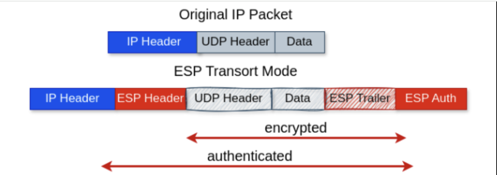
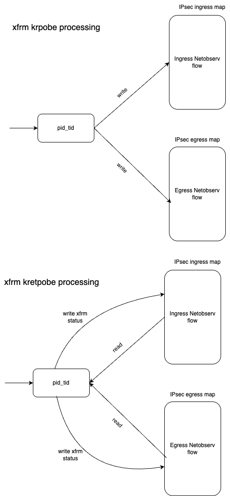
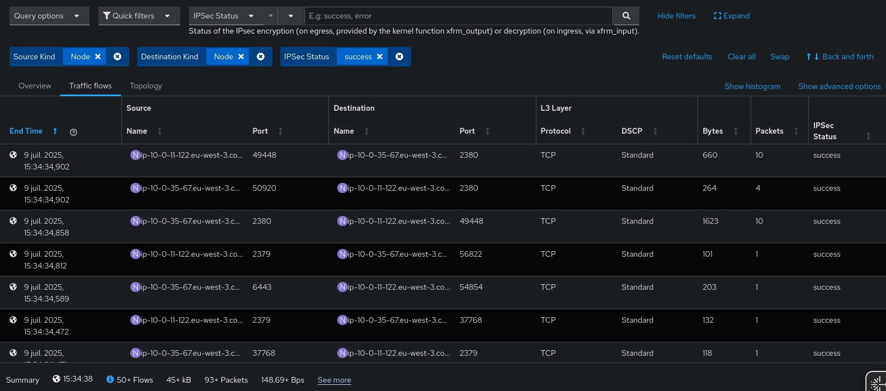

# Monitoring IPsec Encryption and Decryption with eBPF

**IPsec (Internet Protocol Security)** is a widely used protocol suite that secures communication at the IP layer through authentication and encryption. While powerful, IPsec can be opaque—making it difficult to inspect or debug encrypted traffic, especially at the kernel level.

With **eBPF (Extended Berkeley Packet Filter)** and its dynamic tracing capabilities via **kprobes** and **kretprobes**, we can instrument IPsec-related kernel functions without modifying kernel source code or rebooting the system.

In this blog post, we'll show how to leverage eBPF to observe IPsec encryption and decryption processes in the Linux kernel.

---

## Understanding IPsec Traffic

OpenShift uses [**Libreswan**](https://libreswan.org/) to handle IPsec encryption and decryption. The diagram below illustrates how an IPsec packet appears before and after encryption:



---

## 1. Tracing IPsec Encryption

**IPsec encryption** transforms plaintext data into ciphertext to protect it from unauthorized access.

To monitor this process with eBPF:

- Set a **`kprobe`** on the [xfrm_output](https://elixir.bootlin.com/linux/v6.15.3/source/net/xfrm/xfrm_output.c#L743) function to trace when encryption is initiated.
- Set a **`kretprobe`** on the same function to capture its return value and extract flow metadata, allowing us to determine whether encryption was successful.

---

## 2. Tracing IPsec Decryption

**IPsec decryption** converts ciphertext back into plaintext.

To monitor decryption:

- Set a **`kprobe`** on the [xfrm_input](https://elixir.bootlin.com/linux/v6.15.3/source/net/xfrm/xfrm_input.c#L463) function to trace when decryption is triggered.
- Use a **`kretprobe`** on `xfrm_input` to capture the return code and associated flow information, helping determine success or failure.

The following diagram shows how IPsec packets is processed at ebpf layers and how the netobserv flow been created and updated to reflect ipsec packet processing status




---

## Network Observability Enrichment

With eBPF instrumentation, NetObserv enriches flow records with two fields related to IPsec operations:

- **`ipsec_encrypted_ret`**: Contains the kernel return code from the encryption/decryption function.
- **`ipsec_encrypted`**: A boolean indicator (`1` = success, `0` = failure) representing whether encryption or decryption was completed successfully.

---

## IPsec Insights in the UI

The NetObserv user interface provides visibility into IPsec operations as part of flow records:



---

## Enabling IPsec Monitoring

To activate IPsec tracing, update the `FlowCollector` configuration as follows:

```yaml
apiVersion: flows.netobserv.io/v1beta2
kind: FlowCollector
metadata:
  name: cluster
spec:
  agent:
    type: EBPF
    ebpf:
      features:
        - IPSec
```


## Availability

The IPsec feature is available OCP 4.19 and NetObserv release 1.9.


## Conclusion
Network Observability with eBPF provides a powerful way to monitor IPsec encryption and decryption operations in the Linux kernel. By using kprobe and kretprobe, we can dynamically insert probes into IPsec-related kernel functions without modifying kernel source code or requiring system reboots.


## Feedback

We hope you liked this article !
NetObserv is an open source project [available on github](https://github.com/netobserv).
Feel free to share your [ideas](https://github.com/orgs/netobserv/discussions/categories/ideas), [use cases](https://github.com/orgs/netobserv/discussions/categories/show-and-tell) or [ask the community for help](https://github.com/orgs/netobserv/discussions/categories/q-a).
