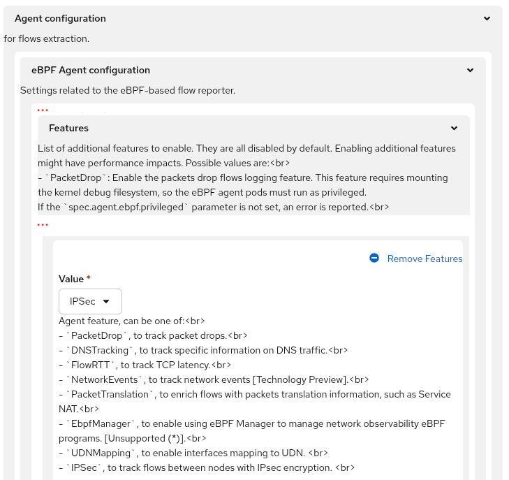
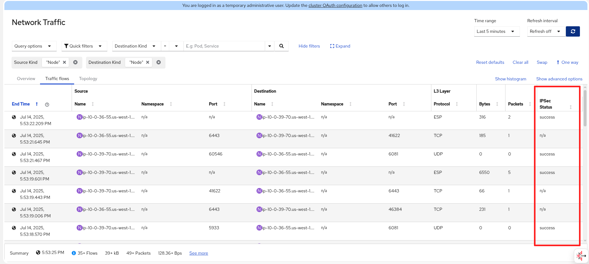
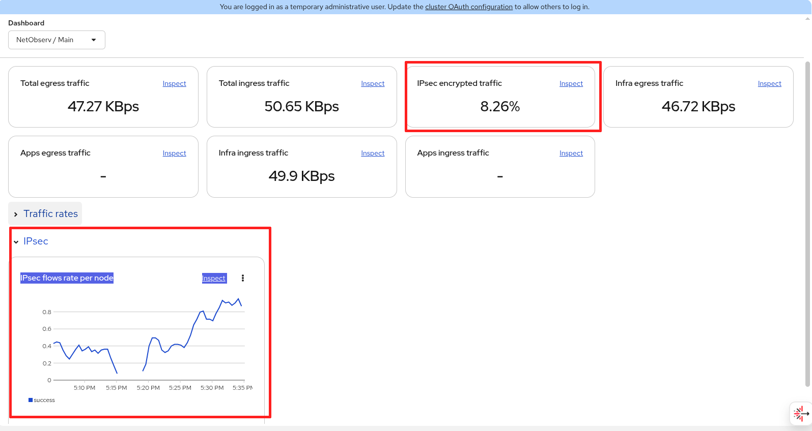
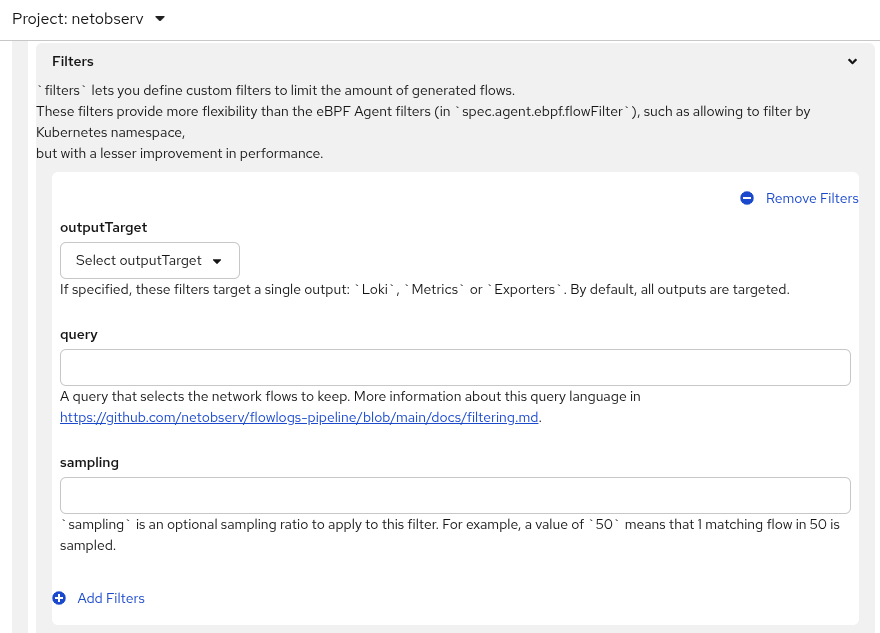
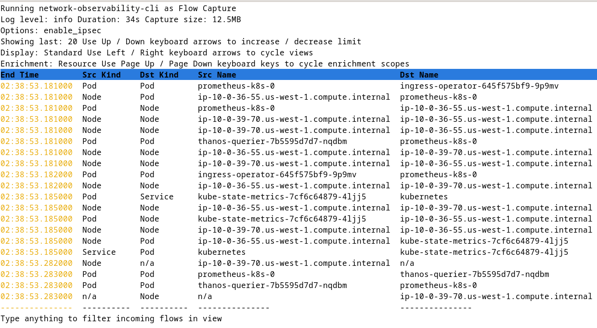
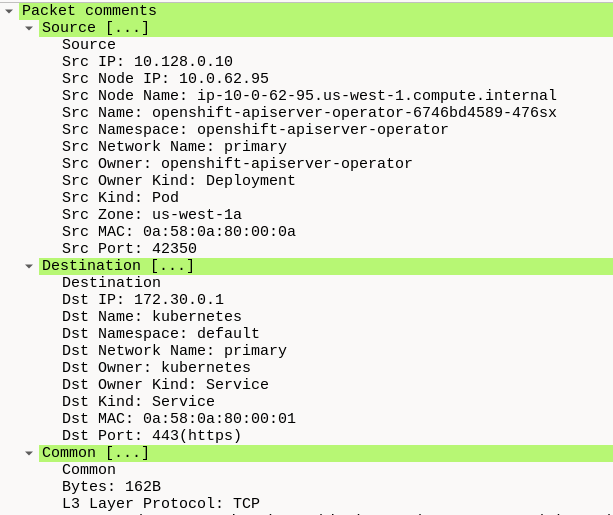

[Network Observability 1.9](https://docs.redhat.com/en/documentation/openshift_container_platform/4.19/html/network_observability/index) is an optional operator that provides insights into your network traffic, including features like packet drops, latencies, DNS tracking, and more.  You can view this in the form of graphs, a table, or topology.

This version aligns with [Red Hat OpenShift Container Platform (OCP) 4.19](https://docs.redhat.com/en/documentation/openshift_container_platform/4.19) but is backwards-compatible with older OCP and Kubernetes releases.  For installation instructions, check out the documentation on [OpenShift Container Platform](https://docs.redhat.com/en/documentation/openshift_container_platform/4.19#Install) and [Network Observability](https://docs.redhat.com/en/documentation/openshift_container_platform/4.19/html/network_observability/installing-network-observability-operators).

This article covers the new features in this release, namely IPsec tracking, flowlogs-pipeline filter query, UDN Mapping, and Network Observability CLI enhancements.  If you want to learn about the past features, read my older [What's new in Network Observability](https://developers.redhat.com/author/steven-lee) articles.

## IPsec tracking

Network Observability can identify IPsec traffic flows and indicate if they were successfully encrypted or not.  To try this out, you need to have OVN-Kubernetes as your Container Network Interface (CNI), which is the default for OCP.

To enable IPsec, follow the instructions on [Configuring IPsec encryption](https://docs.redhat.com/en/documentation/openshift_container_platform/4.19/html/networking/network-security#configuring-ipsec-ovn).  If you didn't enable IPsec during cluster installation, it's a bit tricky to set up, so I've provided a quick guide below on setting this up in a test environment.

Network Observability can identify encrypted IPsec traffic between pods.  In the OpenShift web console, when you create the FlowCollector instance, scroll down to the **Agent configuration** and open up the section named **Features**.  In the dropdown for **Value**, select  **IPSec** as shown in Figure 1.

<br>
Figure 1: Enable IPsec eBPF feature

The equivalent in YAML is to add this in the **spec** section:

```yaml
spec:
  agent:
    ebpf:
      features:
      - IPSec
```

### Network Observability - IPsec feature

In **Observe > Network Traffic, Traffic flows tab**, it adds a new column **IPSec Status** that has the possible values of "success", "error", or "n/a" (Figure 2).

<br>
Figure 2: Flows table with IPSec Status column

IPsec flows always appear as node-to-node traffic, but they are actually encapsulated pod-to-pod or host-to-pod traffic.  There are two types of encapsulation used for IPsec-encrypted flows.  The first is ESP encapsulation, which is the traditional IPsec mode.  ESP packets don't have ports, hence the ports are `n/a`.  The second is UDP encapsulation.  In the table, the destination port is 6081, so they are OVN Geneve tunnel traffic.  If you only see UDP encapsulated traffic (no ESP), then you must have configured `encapsulation: Always` when configuring IPsec.

In **Observe > Dashboards, Network / Main dashboard** dropdown, it shows the percentage of traffic encrypted and the IPsec traffic rate (Figure 3).

<br>
Figure 3: Network/Main dashboard with IPsec data

### Enable IPsec on OVN-Kubernetes

Here are the steps to enable IPsec on OVN-Kubernetes.  You can skip this section if you already have IPsec enabled.

In addition to enabling IPsec, you should reduce the MTU value as this is necessary to avoid packet fragmentation and dropped connections.  Enter `oc edit networks.operator.openshift.io` to update the configuration, but read below to get the right MTU values.  The migration could take half an hour or more so be prepared for some downtime.

```yaml
spec:
  defaultNetwork:
    ovnKubernetesConfig:
      gatewayConfig:
        routingViaHost: true  # change
      ipsecConfig:
        mode: Full  # change
      mtu: 8855  # update with your MTU value and below
  migration:  # add this section
    mtu:
      network:
        from: 8901
        to: 8855
      machine:
        to: 9001
```

Make the two changes with the comment "change" to enable IPsec.  Reduce the network MTU by 46 bytes, which is needed by the ESP header to do IPsec encryption.  My current network MTU value was 8901 (using jumbo frames) and was reduced to 8855.  Therefore, the overlay packets generated by the pods won't exceed 8855 bytes, and this provides the 46-byte overhead for the ESP header.  You also need to provide the machine or physical MTU on the interface even though it won't be changed.

To get the network MTU, enter `oc get networks.operator.openshift.io -o yaml | grep mtu`.  To get the machine MTU, look at the example below and issue the commands, but replace with your pod name.

```
$ oc project openshift-ovn-kubernetes
$ oc get pods
NAME                                     READY   STATUS    RESTARTS        AGE
ovnkube-control-plane-595bf6d946-9gjjb   2/2     Running   2 (4h48m ago)   5h3m
ovnkube-node-5h682                       8/8     Running   1 (4h58m ago)   4h58m
ovnkube-node-94z84                       8/8     Running   0               5h3m

$ oc rsh ovnkube-node-5h682

sh-5.1# ip link show
...
2: ens5: <BROADCAST,MULTICAST,UP,LOWER_UP> mtu 9001 qdisc mq master ovs-system state UP mode DEFAULT group default qlen 1000
    link/ether 06:a5:5a:cd:ff:6b brd ff:ff:ff:ff:ff:ff
    altname enp0s5
```

Look for the interface such as *ensX* and the *mtu* value.  Here, it's 9001.  The original network MTU was 100 bytes less at 8901 to provide overhead for the Geneve header.  Now we're reducing it another 46 bytes to 8855 for the ESP header.

Now you can start the migration and IPsec enablement.  During this process, you will lose connection to the cluster.  It may be five minutes or longer before it automatically connects back.  When it does, IPsec pods should be running.

```
$ oc get pods
NAME                                     READY   STATUS    RESTARTS      AGE
ovn-ipsec-containerized-jpnxr            1/1     Running   1             4m14s
ovn-ipsec-containerized-w6r9c            1/1     Running   1             4m14s
ovn-ipsec-host-27j49                     2/2     Running   2             4m14s
ovn-ipsec-host-jjb54                     2/2     Running   2             4m14s
ovnkube-control-plane-595bf6d946-9gjjb   2/2     Running   6             5h24m
ovnkube-node-dfhck                       7/8     Running   7 (16s ago)   3m32s
ovnkube-node-dtq28                       7/8     Running   8             4m11s
```

While the IPsec pods are up and running, the other parts of the cluster might not be ready yet, including Network Observability.  To ensure the cluster is stable, enter `oc adm wait-for-stable-cluster`.


## Flowlogs-pipeline filter

Flowlogs-pipeline filter lets you filter data after it has been enriched with Kubernetes information, and before ingestion.  It can filter logs (Loki data), metrics (Prometheus data), or logs to be exported, or all of them, which corresponds to the **outputTarget** field (Figure 4) when configuring a FlowCollector instance.  In the FlowCollector form view, scroll down to the **Processor configuration** section and click to open it.  Then click **Filters** and then **Add Filters**.  You can also set a different sampling value than the one used by the eBPF Agent.

The query uses a simple query language that supports 8 comparison operators, the 6 standard ones (`=`, `!=`, `>`, `>=`, `<`, `<=`), plus two more to match or not match a regular expression (`=~`, `!~`).  It can check if a field exists or not (`with(field)`, `without(field)`.  Finally, the query language allows `and` and `or` with parentheses to specify precedence for more complex expressions.

<br>
Figure 4: Flowlogs-pipeline filters configuration

Don't confuse this with the eBPF flow filter, which happens at a much earlier stage at the packet level.  Flowlogs-pipeline filter doesn't benefit as much from resource savings as eBPF flow filter because part of the processing of flows has already happened.  To get a list of field names for the query, see the [documentation](https://docs.redhat.com/en/documentation/openshift_container_platform/4.19/html/network_observability/json-flows-format-reference) or click a row in the Traffic flows table, and then click the **Raw** tab.

Here's a query to include only "netobserv" traffic.

```
SrcK8S_Namespace="netobserv" or DstK8S_Namespace="netobserv"
```

For more information, see [FLP filtering language](https://github.com/netobserv/flowlogs-pipeline/blob/main/docs/filtering.md).


## UDN Mapping (GA)

The eBPF feature **UDNMapping** reached General Availability (GA).  Network Observability added support for the ClusterUserDefinedNetwork object.  In 1.8, it only supported UserDefinedNetwork.  ClusterUserDefinedNetwork allows pods in different namespaces to communicate with each other using the cluster UDN.  To learn more about how to set up a UDN, see the article [User defined networks in Red Hat OpenShift Virtualization](https://www.redhat.com/en/blog/user-defined-networks-red-hat-openshift-virtualization).


## Network Observability CLI enhancements

The Network Observability CLI is a command line tool based on the Network Observability code base.  It is an `oc` plugin that captures, displays, and saves flows, metrics, and/or packet information.

Installation is simple.  Download the [oc_netobserv file](https://mirror.openshift.com/pub/cgw/netobserv/latest/) and put it in a location that is accessible from the command line (e.g. */usr/local/bin* on Linux).  Make the file executable.  You don't even need to install Network Observability Operator, nor will it conflict with it if it's installed.

You must be able to access your cluster from the command line using `oc` or `kubectl`.  It's best to widen your terminal to 100 characters or more for a better display.  To run the program, enter `oc netobserv` or just call the script directly, `oc-netobserv`, followed by various options.

Decide whether you want to see flows, metrics, or capture packets.  If you want more information on this, enter one or more of these commands.

```
oc netobserv flows help
oc netobserv metrics help
oc netobserv packets help
oc netobserv help  # for general help
```

With flows, it displays a text-based traffic flows table.  With metrics, you are given a link that creates a dynamic dashboard in the OpenShift web console.  And with packets, you also get flows, and it saves a pcapng file that can be loaded in with a tool such as Wireshark.  All of this data can be saved locally upon exit.

Network Observability CLI deploys in its own namespace and is automatically removed once the CLI exits.  To manually exit, press ctrl-c.  It asks if you want to save the data in the directory **./output** and then exits.

The rest of this section covers the new features in Network Observability CLI 1.9.  Here are the new options:

| Option                    | Description                         |
| ------------------------- | ----------------------------------- |
| `--enable_ipsec`          | Enable eBPF IPsec tracking feature  |
| `--enable_network_events` | Enable eBPF Network Events feature  |
| `--enable_udn_mapping`    | Enable eBPF UDN Mapping feature     |
| `--sampling`              | Set sampling ratio, defaults to 1   |
| `--query`                 | Define a query filter               |
| `--exclude_interfaces`    | List of interfaces to exclude       |
| `--include_list`          | List of metric names (metrics only) |
| `--yaml`                  | Generate a FlowCollector YAML       |

This version catches up with all of the eBPF features that were introduced in Network Observability, including the latest IPsec tracking.  These are the options that begin with `--enable`.  The new `--sampling` option sets the sampling ratio and defaults to 1, which is unlike Network Observability Operator which defaults to 50.  The `--regexes` option has been removed in favor of the `--query` option.  It allows you to enter an expression, similar to the filter UI in **Observe > Network Traffic**.

Here's an example command that enables IPsec tracking and displays flows where the IPsec encryption was successful.  It uses a sampling ratio of 1:10.

```
oc netobserv flows --query='IPSecStatus="success"' --enable_ipsec --sampling=10
```

Pay attention to the syntax of `--query`.  It is followed by an equals character and wrapped in a pair of single quotes.  Double quotes are used if the value is a string.  The field name does not have quotes.  The query and the [field names](https://docs.redhat.com/en/documentation/openshift_container_platform/4.19/html/network_observability/json-flows-format-reference) are the same as flowlogs-pipeline filter query.  Figure 5 shows the screenshot of this command.

<br>
Figure 5: Network Observability CLI - Flows table with IPsec

The `--exclude_interfaces` is a list of comma-separated interfaces to exclude.  The `--include_list` is a metrics-only option to specify a list of comma-separated metric names.  See the metrics help for the default list of names.

The last new option is the unique `--yaml`.  Add in your features and filter options after `oc netobserv --yaml` command.  It creates a FlowCollector YAML that you can apply and reuse, and prints out the command to run.  Save this command.  When you run it, it starts up Network Observability CLI with all the options you gave it.  Here's an example of running with this option.

```
$ oc netobserv flows --enable_ipsec --yaml
...
You can create flows agents by executing:
 oc apply -f ./output/flows_capture_2025_07_14_07_14.yml

Then create the collector using:
 oc run -n netobserv-cli collector \
  --image=registry.redhat.io/network-observability/network-observability-cli-rhel9:1.9.0 --image-pull-policy='Always'   --overrides='{"spec": {"serviceAccount": "netobserv-cli"}}' \
  --command -- bash -c "/network-observability-cli get-flows --options enable_ipsec --loglevel info --maxtime 5m --maxbytes 50000000 && sleep infinity"

And follow its progression with:
 oc logs collector -n netobserv-cli -f
```

Finally, the pcapng file was enhanced to include enrichment data as comments.  The command below starts the packet capture.  Upon exit, save the capture output.

```
oc netobserv packets --port=443
```

Now run Wireshark on this file, which is in the **./output/pcap** directory.  Update with your output filename.

```
# Update with your output filename
wireshark output/pcap/2025-07-22T212639Z.pcapng
```

When Wireshark comes up, select a row and click the **Packet comments** section to open up this section (Figure 6).

<br>
Figure 6: Wireshark - Packet capture file with comments


## Summary

This is another solid release from the Network Observability team.  If you use IPsec, you can get insight into this type of traffic.  A filter query was added in both flowlogs-pipeline and the Network Observability CLI.  If you want to easily capture flows, metrics, and packets, Network Observability CLI is the tool for you!  Write to us on the [discussion board](https://github.com/netobserv/network-observability-operator/discussions) if you have any feedback or suggestions for improvements.

_Special thanks to Julien Pinsonneau, Joel Takvorian, Mehul Modi, and Mohamed S. Mahmoud for reviewing._
