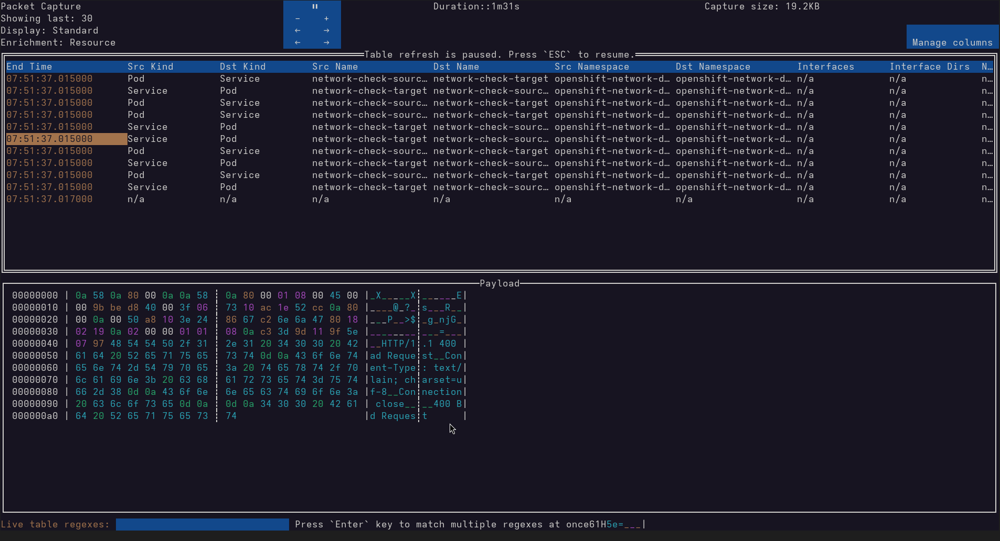

The NetObserv 1.10 release introduces a sleek, interactive command-line interface powered by the excellent [tview library](https://github.com/rivo/tview) and one of its extension [tvxwidgets](https://github.com/navidys/tvxwidgets).

These open-source Go packages bring a rich set of UI components such as buttons, dropdowns, popups and tables, all seamlessly integrated into your terminal.

 
Figure 1: Tview examples

# Key Capabilities

## Table View Enhancements

The flow and packet capture keeps the same abilities, showing the flow table, cycling between `displays` and `enrichments` and applying `live filters`.

 
Figure 2: Flow table view

New in 1.10:
- *Customizable Columns*: Click the `Manage Columns` button to select which columns to display and tailor the table to your needs.  
 
Figure 3: Column selection popup

- *Smart Filtering*: Live filters now include auto-suggestions, making it easier to select the right keys and values.  
 
Figure 4: Live filters suggestions

- *Packet Preview*: When capturing packets, simply click a row to inspect the pcap content directly.  
 
Figure 5: Packet content display

## Terminal-Based Line Charts

Metrics visualization takes a leap forward with real-time graphs rendered directly in the CLI.
 
Figure 6: Metrics graphs

Features include:
- *Panel Selection*: Choose from predefined views or build your own dashboard via the `Manage Panels` popup.
- *Time Range Control*: Use the dropdown to select a time window up to the last 6 hours of data.

 
Figure 7: Panel management popup

And of course, the full `NetObserv / On Demand` dashboard remains available in the OpenShift Console for deeper insights.

# UI Gallery

A visual tour of the new CLI experience:

  
  
  
  
  
  
