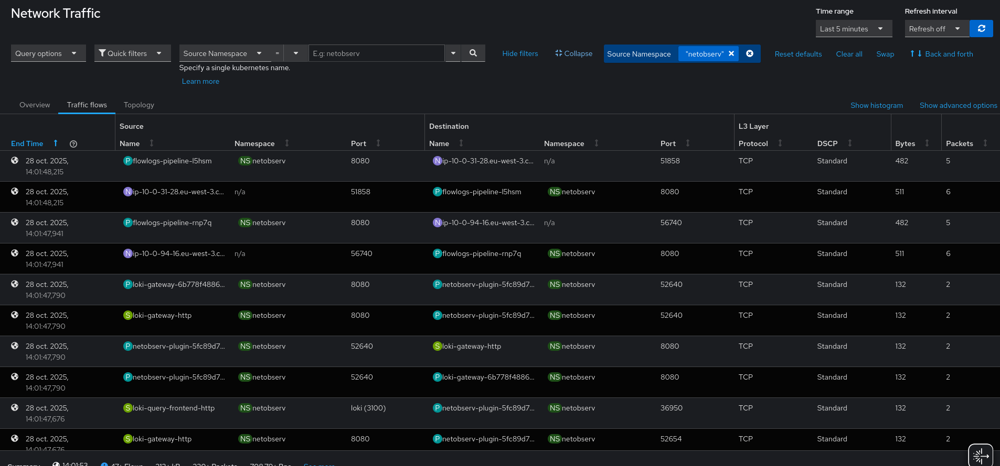
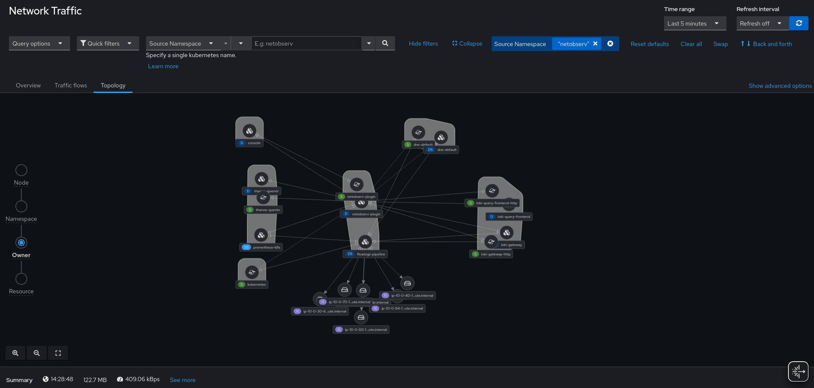
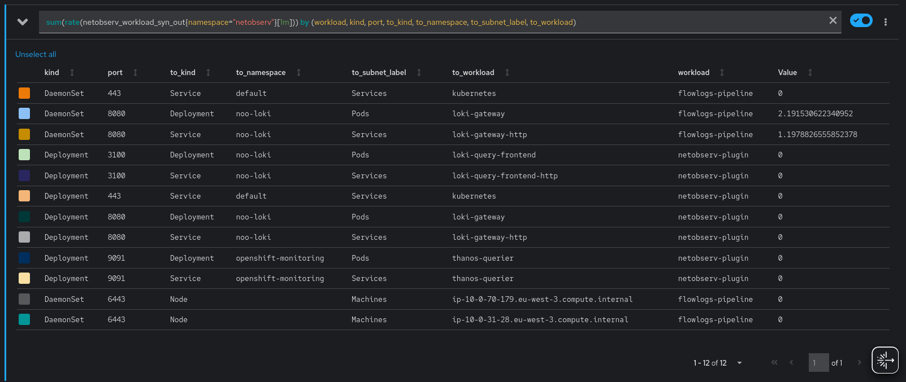
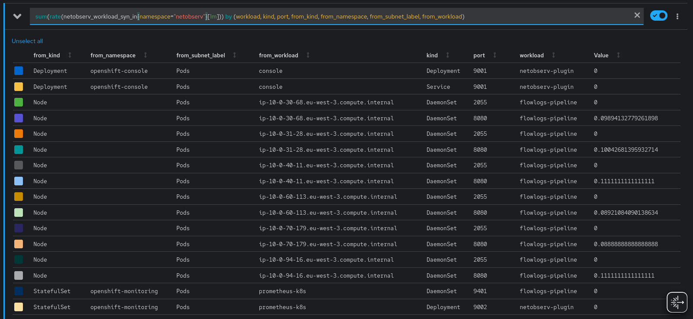
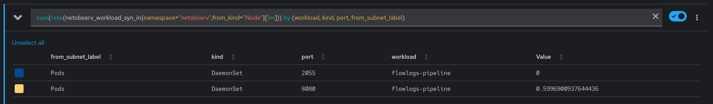
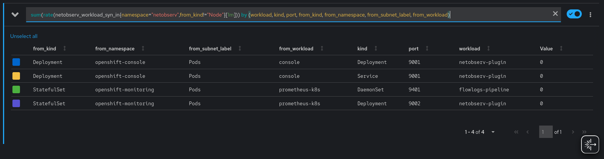
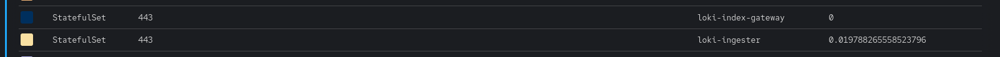
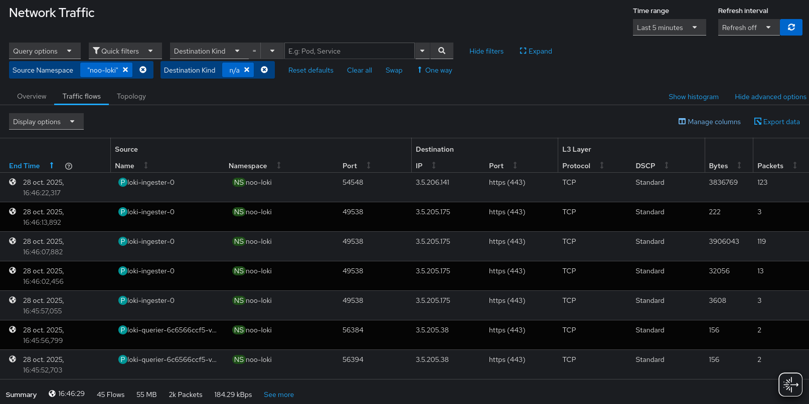
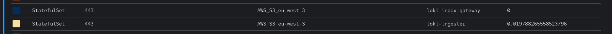

_Thanks to: placeholder for reviewers_

The NetObserv eBPF agents can observe all the traffic going through your cluster. They extract all the meaningful metadata which is then used to represent the network topology. There's everything you need there to understand who's talking to who in your cluster.

In fact, there is probably _too much_ information, making it potentially hard to navigate, depending on what you're trying to achieve. For instance, to figure out the network policies needed for a given namespace, using only the raw data provided by NetObserv might not be the simplest way. We'd recommend using more advanced features, in particular the _FlowMetrics_ API, which allows you to generate metrics tailored for your needs.

## A use-case: NetObserv own network flow matrix

Let’s consider this use case: using NetObserv to understand its own relationships with other components. Considering you have already installed NetObserv, Loki and the FlowCollector resource with **sampling set to 1**.

The `FlowMetrics` API does not require Loki, however it's still recommended, for better troubleshooting. Installing Loki for testing purpose is as simple as: 

```bash
oc create namespace netobserv
oc apply -f https://raw.githubusercontent.com/netobserv/documents/5410e65b8e05aaabd1244a9524cfedd8ac8c56b5/examples/zero-click-loki/1-storage.yaml -n netobserv
oc apply -f https://raw.githubusercontent.com/netobserv/documents/5410e65b8e05aaabd1244a9524cfedd8ac8c56b5/examples/zero-click-loki/2-loki.yaml -n netobserv
```

### The "out-of-the-box" approach

The first thing you can do is to look at the Traffic flows view in the Console plugin, filtering on the namespace you're interested in (here `netobserv`). You can filter just by source and select the "back and forth" option, in order to get the bidirectional traffic.



Here we see some nodes talking to `flowslogs-pipeline`, or `netobserv-plugin` talking to the Loki gateway... Everything can be displayed here, but there's also a lot of redundant information, there is the noise of the source ports (which become destination ports in the responses), it's a flat view requiring a lot of scrolling to capture all the meaningful bits. Moreover, the data is pulled from Loki, which is not great if you want weeks of data. We need something more concise.

The topology view helps for sure: it aggregates some of the data, for instance per owner (workload) instead of per pod.



So you clearly see the relationships between workloads. It's also better at showing long time ranges, being based on Prometheus metrics. However, it might not be the best fit for building our flow matrix, especially if it's a large one, as it can become messy when the observed system is very complex. It's also lacking the destination port information which we may want to include.

Let's look for another approach.

### The FlowMetrics API

The [FlowMetrics API](https://github.com/netobserv/network-observability-operator/blob/main/docs/FlowMetric.md) is a very good fit here, because it allows you to shape the metrics that you want. You choose what to aggregate on, what to filter on, what to observe. What do we want here? For every connection:

- The source (client) workloads and namespaces
- The destination (server) workloads, namespaces and ports

That's mostly it.

There's a catch with the destination ports: as mentioned before, when a client connects to a server, the destination port is the server port, but in the server responses it's the other way around, the destination becomes the client. Because NetObserv operates at the L3/4 level, it doesn't know what is the client and what is the server. So we want to rule out the client ports from the flow matrix, which are basically random ports.

An option to solve it is to focus just on SYN packets. When a SYN packet is observed, we can assume the destination port is the server/listening port. Since NetObserv does capture the TCP flags, we can simply filter on that in our metric definition; here's the full YAML:

```yaml
apiVersion: flows.netobserv.io/v1alpha1
kind: FlowMetric
metadata:
  name: workload-syn-in
  namespace: netobserv
spec:
  type: Counter
  labels:
  - SrcSubnetLabel
  - SrcK8S_Namespace
  - SrcK8S_OwnerName
  - SrcK8S_OwnerType
  - DstSubnetLabel
  - DstK8S_Namespace
  - DstK8S_OwnerName
  - DstK8S_OwnerType
  - DstPort
  - Flags
  flatten: [Flags]
  filters:
  - field: Flags
    value: SYN
  remap:
    SrcK8S_Namespace: from_namespace
    SrcK8S_OwnerName: from_workload
    SrcK8S_OwnerType: from_kind
    SrcSubnetLabel: from_subnet_label
    DstK8S_Namespace: namespace
    DstK8S_OwnerName: workload
    DstK8S_OwnerType: kind
    DstSubnetLabel: subnet_label
    DstPort: port
```

Explanation, part by part:

```yaml
spec:
  type: Counter
```

We're going to count every flow received that satisfies the filters. The other types are `Gauge` and `Histogram`, which are not relevant for this purpose.
In fact, in this case, we don't really care about the metric value. What we care about is the relationship between labels. So it doesn't matter too much which metric type we're setting here.

```yaml
  labels:
  - SrcSubnetLabel
  - SrcK8S_Namespace
  - SrcK8S_OwnerName
  - SrcK8S_OwnerType
  - DstSubnetLabel
  - DstK8S_Namespace
  - DstK8S_OwnerName
  - DstK8S_OwnerType
  - DstPort
  - Flags
```

Labels are what flows are going to be aggregated on. When several flows are recorded with the exact same set of labels, the corresponding metric counter is incremented. If any of those labels differ from the previously recorded flows, it results in a new time-series that starts at 1.

This list of labels is roughly what we described above, plus the `SrcSubnetLabel` / `DstSubnetLabel` which will be explained below, and the `Flags` (TCP flags) which we need for flattening+filtering as explained below.

You can read more about all the available fields [here](https://github.com/netobserv/network-observability-operator/blob/main/docs/flows-format.adoc).

```yaml
  flatten: [Flags]
  filters:
  - field: Flags
    value: SYN
```

Because `Flags` comes as a list of strings, we need to flatten it before we can filter. Without the flatten operation, the `Flags` would appear as a list such as `Flags=SYN,ACK,RST`. When flattened, that flow is mapped into three flows (`Flags=SYN`, `Flags=ACK` and `Flags=RST`). The filter operation keeps only the SYN one, which stands for the TCP connection being established between a client and a server.

```yaml
  remap:
    SrcK8S_Namespace: from_namespace
    SrcK8S_OwnerName: from_workload
    SrcK8S_OwnerType: from_kind
    SrcSubnetLabel: from_subnet_label
    DstK8S_Namespace: namespace
    DstK8S_OwnerName: workload
    DstK8S_OwnerType: kind
    DstSubnetLabel: subnet_label
    DstPort: port
```

Finally, the remapping operation is optional but is provided as a syntactic sugar when manipulating later the metric with `promQL`, the Prometheus query language. Because we are creating here a metric named `workload-syn-in`, that is to say, focused on the incoming traffic to our namespace of interest, we're renaming the `Dst*` labels in a more workload-centric fashion and the `Src*` as the opposite side prefixed with `from_`.

With this config, the query looks like: `netobserv_workload_syn_in{ namespace="my-namespace"}`.

We then create another metric, almost identical, except for the remapping, focused on the outgoing traffic:

```yaml
apiVersion: flows.netobserv.io/v1alpha1
kind: FlowMetric
metadata:
  name: workload-syn-out
  namespace: netobserv
spec:
  type: Counter
  flatten: [Flags]
  labels:
  - SrcSubnetLabel
  - SrcK8S_Namespace
  - SrcK8S_OwnerName
  - SrcK8S_OwnerType
  - DstSubnetLabel
  - DstK8S_Namespace
  - DstK8S_OwnerName
  - DstK8S_OwnerType
  - DstPort
  - Flags
  filters:
  - field: Flags
    value: SYN
  remap:
    DstK8S_Namespace: to_namespace
    DstK8S_OwnerName: to_workload
    DstK8S_OwnerType: to_kind
    DstSubnetLabel: to_subnet_label
    SrcK8S_Namespace: namespace
    SrcK8S_OwnerName: workload
    SrcK8S_OwnerType: kind
    SrcSubnetLabel: subnet_label
    DstPort: port
```

With promQL looking like: `netobserv_workload_syn_out{ namespace="my-namespace"}.`

You could really create just 1 metric here instead of 2, without the remapping but the `promQL` is a little less simple to reason about when you have to juggle between Src and Dst fields.

### Viewing the result

To get all the outgoing traffic, open your Prometheus console and run:

```
sum(rate(netobserv_workload_syn_out{ namespace="netobserv"}[1m])) by (workload, kind, port, to_kind, to_namespace, to_subnet_label, to_workload)
```

(Replace "netobserv" with any namespace you're interested in)



We can see which traffic we need to allow:
- `flowlogs-pipeline` talks to `kubernetes` on 443 and nodes on 6443 (it's the API server) and to the Loki gateway on 8080
- `netobserv-plugin` talks to the Loki gateway on 8080, Loki frontend on 3100, Thanos on 9091 and the API server on 443.

When in doubt, we can fallback on the regular Traffic flows view of the plugin to analyse traffic more in depth.

For the incoming traffic:

```
sum(rate(netobserv_workload_syn_in{ namespace="netobserv"}[1m])) by (workload, kind, port, from_kind, from_namespace, from_subnet_label, from_workload)
```



Here we immediately notice that many nodes are talking to `flowlogs-pipeline`, which creates some noise, so let's split the query into two: one for the nodes and another for the rest. Another possibility would be to create two different FlowMetrics, one being dedicated to the traffic coming from nodes.

For nodes:

```
sum(rate(netobserv_workload_syn_in{ namespace="netobserv",from_kind="Node"}[1m])) by (workload, kind, port, from_subnet_label)
```

As you can see, we do _not_ aggregate by `from_workload`, thus removing the noise of which node the traffic originates from - we don't care about that, knowing that it comes from nodes in general should be sufficient.



Which leaves us with just two entries, and more specifically two ports:
- 2055: used for collecting netflows from the eBPF agent. The reason why it's considered node traffic is because it's configured to use the host network.
- 8080: this is the port that we declared for Kubernetes health probes.

And finally, for non-nodes:

```
sum(rate(netobserv_workload_syn_in{ namespace="netobserv",from_kind!="Node"}[1m])) by (workload, kind, port, from_kind, from_namespace, from_subnet_label, from_workload)
```



We just see here the OpenShift Console calling our plugin on port 9001, and OpenShift Monitoring fetching our metrics on 9401 (for flowlogs-pipeline) and 9002 (for our plugin).

### What about external traffic?

We will cover more in detail, in another blog post, how to identify external traffic in NetObserv metrics.

But to make it short here, when the traffic is going to a public / cluster external IP, NetObserv doesn't know what it is so you will see mostly empty fields in the related metrics:



... that is, unless you help NetObserv understand what it is.

Of course, that means you need to know what are the external workloads or services that your workloads are talking to. We can figure that out by going to the Traffic flows tab of the Console plugin.

Setting filters with the desired Source Namespace and Destination Kind to an empty double-quoted string (`""`), will show what we want. Additionally, we can change the visible columns to show the Destination IP (click on "Show advanced options" then "Manage columns").



There are IPs such as 3.5.205.175. A `whois` shows that it's Amazon S3 behind that.

Let's reconfigure our `FlowCollector` with the Amazon S3 IP ranges, so that NetObserv is aware of it.

```yaml
spec:
  processor:
    subnetLabels:
      openShiftAutoDetect: true
      customLabels:
      - cidrs:
        - 16.12.20.0/24
        - 52.95.156.0/24
        - 3.5.204.0/22
        - 52.95.154.0/23
        - 16.12.18.0/23
        - 3.5.224.0/22
        - 13.36.84.48/28
        - 13.36.84.64/28
        name: "AWS_S3_eu-west-3"
```

Now, back to the metrics, you will see this name appearing under the label `to_subnet_label` (or `from_subnet_label`).



If you have more undetermined traffic, rinse and repeat until you identify everything, and then you should have all the required pieces for your network policy.

## Summary and additional notes

With this use-case and the FlowMetrics API, we've been able to identify precisely, and in a concise way, which workloads we are talking to. We clearly identify both the ingress and egress traffic, which help create a network policy. Some additional aspects to take into account:

- After having created the `FlowMetrics`, you should probably restart the pods that you want to monitor, so that they re-establish all the connections. This is especially needed if they use long-standing connections, where the SYN packets that we monitor aren't going to be sent again.
- We focused here on TCP connections. You can monitor UDP in a similar way, except that you won't have the SYN trick for removing the noise with source ports. The `Proto` field holds the L4 protocol ([UDP is 17](https://en.wikipedia.org/wiki/List_of_IP_protocol_numbers)).
- When you create a network policy for OVN, you can use the Network Events feature, alongside with a TechPreview OpenShift cluster, to troubleshoot network policy allowed and denied traffic. [This previous post](https://netobserv.io/posts/monitoring-ovn-networking-events-using-network-observability/) tells you more about it.
