Welcome to another post on **What's new in Network Observability**.  With the release of [Red Hat OpenShift Container Platform (OCP) 4.20](https://docs.redhat.com/en/documentation/openshift_container_platform/4.20), we have Network Observability 1.10.  This release is backwards-compatible to all the supported versions of OpenShift, including an upstream version for Kubernetes.

Network Observability is an optional operator that provides insights into your network traffic, by collecting and aggregating network flow data using eBPF technology.  The data is enriched with Kubernetes context, such as pods, services, namespaces, and nodes, and is presented to the user in the form of graphs, tables, and a topology view.  It not only provides deep visibility but can troubleshoot problems related to packet drops, latencies, DNS errors, and more.

This article covers only the new features of 1.10.  You can read about the older releases in my other [What's new in Network Observability](https://developers.redhat.com/author/steven-lee) articles.  For a comprehensive coverage of all features, see the official [Red Hat Network Observability documentation](https://docs.redhat.com/en/documentation/openshift_container_platform/4.20/html/network_observability/index).

The starting point is that you have Red Hat OpenShift web console running and the command line `oc` on your computer.

## FlowCollector Setup UI

After [installing the Network Observability Operator](https://docs.redhat.com/en/documentation/openshift_container_platform/4.20/html/network_observability/installing-network-observability-operators), you should create a FlowCollector custom resource or instance.  This allows you to configure the many parameters of network observability.  In this release, there is a new 4-step wizard that simplifies the creation of this resource (Figure 1).

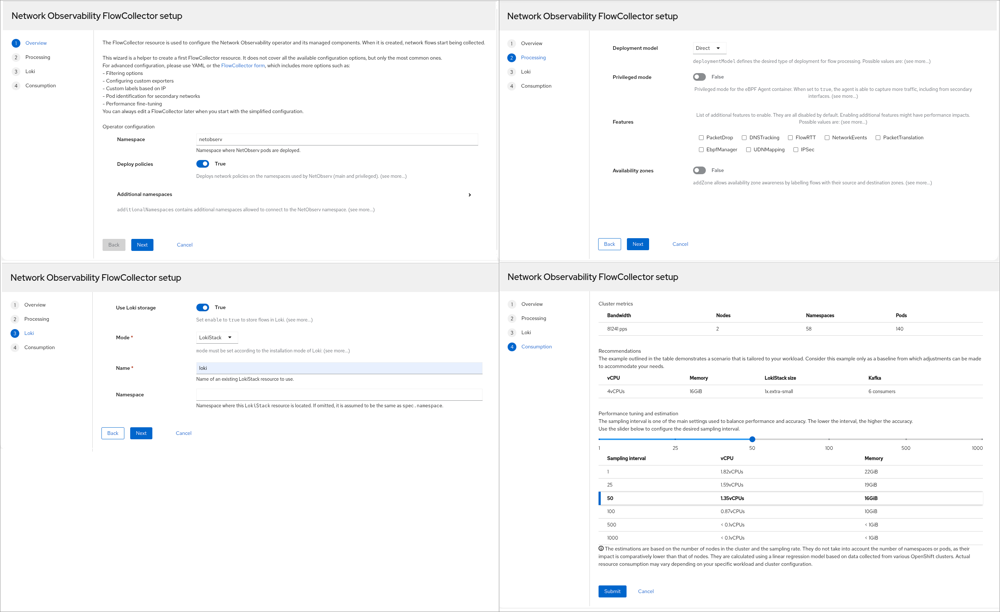<br>
Figure 1: FlowCollector Wizard

Step 1 gives an overview of what FlowCollector is and some basic configuration.  The field, **Deploy policies**, will be covered in the section "Improve Security with Network Policies".  If you prefer the traditional Form view or YAML view, since many parameters are not shown in the wizard, click the **FlowCollector form** link in the second paragraph.

Step 2 lets you choose the **Deployment model**, where you can enable Kafka, which is typically necessary for large clusters.  This is also where you can enable various eBPF features, many of which help with troubleshooting.  And finally, you can choose to include zone information.

Step 3 configures Loki to store flow logs.  Although optional, [without Loki](https://docs.redhat.com/en/documentation/openshift_container_platform/4.20/html/network_observability/installing-network-observability-operators#network-observability-without-loki_network_observability), there will not be a traffic flows table as only metrics will be stored.  The default Loki mode is **LokiStack** instead of **Monolithic**.

Step 4 provides guidance on setting the sampling interval.

### FlowCollector status

Once you click **Submit** in step 4, it shows a graphical status as FlowCollector initializes and comes up.

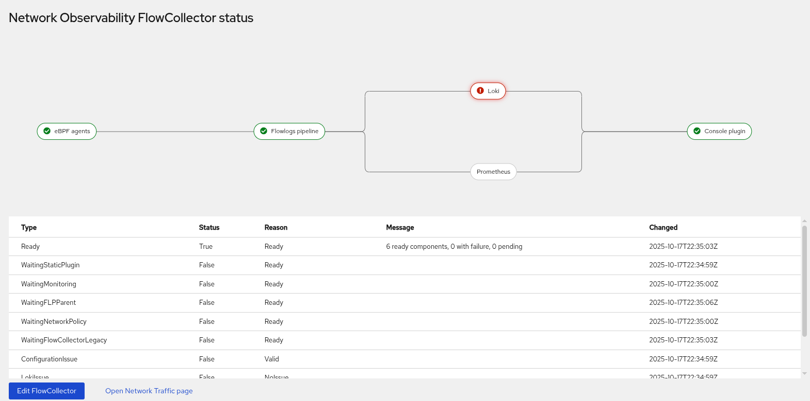<br>
Figure 2: FlowCollector Status

## FlowMetric Setup UI

Like the FlowCollector Setup, there is a new 4-step wizard for FlowMetric Setup (Figure 3).  The FlowMetric CRD lets you define your own custom metrics.

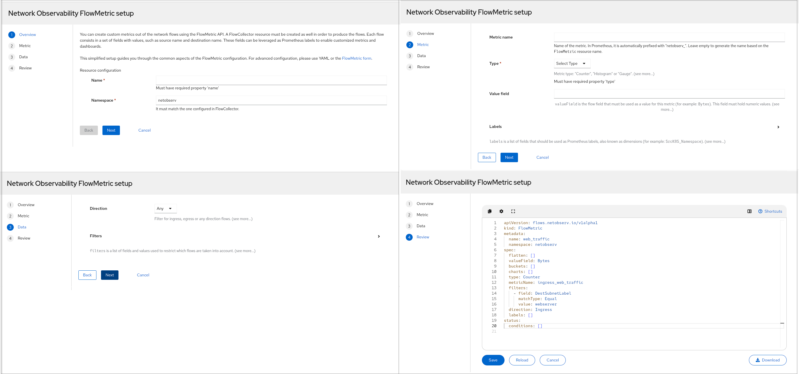<br>
Figure 3: FlowMetric Wizard

Step 1 provides an overview of custom metrics.  You start off by giving the metric a resource name and a namespace.

Step 2 asks for information about the metric, such as the metric name, type (Counter, Histogram, or Gauge), the [name of the field](https://docs.redhat.com/en/documentation/openshift_container_platform/4.20/html/network_observability/json-flows-format-reference) used by this metric called **Value field**, and an optional list of Prometheus labels.

Step 3 asks for the direction of the flow and a list of filters to determine what flows you're interested in.

Step 4 displays the manifest (YAML) that will be applied, with the option to edit this before saving.

## Improve Security with Network Policies

To improve the security hygiene of your cluster, it is highly recommended that you apply a network policy to allow only the necessary traffic between Network Observability and other pods for both ingress and egress.  In this release, when the Container Network Interface (CNI) plugin is OVN-Kubernetes, the network policies are created and enabled by default as shown in step 2 of the FlowCollector Setup.

If you use Loki or Kafka, it's recommended that you put these components in a different namespace for better isolation.  When using the FlowCollector wizard, it will automatically update the network policy accordingly.  Otherwise, you have to make sure the Network Observability network policy, located at **Networking > NetworkPolicies**, is allowed to communicate with Loki and/or Kafka.

## Technology Preview: Custom Alerts

Up until now, Network Observability focused on showing the network traffic flows for your cluster.  This is the first release where it's providing notifications in the form of alerts.

This is a Technology Preview (TP) feature, and hence, there is no support until General Availability (GA), so use with caution.  The feature is disabled by default, so first you must enable it.  On the terminal, enter `oc edit flowcollector`, and configure the following in the **advanced** section:

```yaml
spec:
  processor:
    advanced:
      # add these two lines
      env:
        EXPERIMENTAL_ALERTS_HEALTH: "true"  # must have quotes
```

For convenience, Network Observability has many predefined alerts, but they are only active if the specific eBPF feature is enabled.  For example, if you want alerts for DNS, edit FlowCollector to add **DNSTracking**:

```yaml
spec:
  agent:
    ebpf:
      features:
      - DNSTracking
```

Refresh the browser page and go to **Observe > Alerting**.  Click the **Alerting rules** tab.  In the dropdown for **Name**, change it to **Label**.  Enter `app=netobserv`.  You should see the three **DNSErrors_** alerts, in addition to the four **NetObserv** alerts (Figure 4).  If not, wait a few seconds.  If it still doesn't show up, make sure the changes were accepted in FlowCollector.

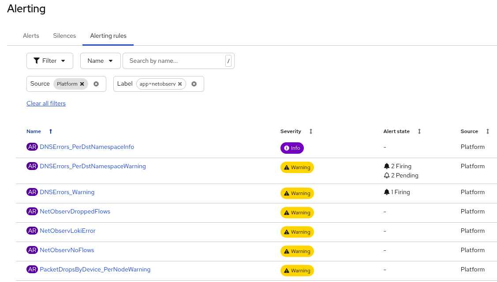<br>
Figure 4: Alerting Rules

Here is the FlowCollector configuration if you want to see all the predefined alerts.  You must also enable **privileged** mode for PacketDrop.

```yaml
spec:
  agent:
    ebpf:
      features:
      - DNSTracking
      - FlowRTT
      - IPSec
      - NetworkEvents
      - PacketDrop
      privileged: true
```

Underneath the covers, it creates a PrometheusRule object.  To see what that looks like, enter `oc get prometheusrules -n netobserv -o yaml`.  However, if you want to modify a predefined alert, you must [edit FlowCollector as described here](https://docs.redhat.com/en/documentation/openshift_container_platform/4.20/html/network_observability/network-observability-alerts_nw-observe-network-traffic#network-observability-configuring-predefined-alerts_network-observability-alerts).  If you get ambitious, you can also write your own custom alerts!  See [Alerts in the NetObserv Operator](https://github.com/netobserv/network-observability-operator/blob/main/docs/Alerts.md) for more information on this feature.

## Technology Preview: Network Health Dashboard

The second Technology Preview is a network health dashboard.  The same environmental variable, EXPERIMENTAL_ALERTS_HEALTH, also used for Custom Alerts (see listing above), enables this feature.

Refresh the browser, and now there is a new menu panel at **Observe > Network Health** (Figure 5).

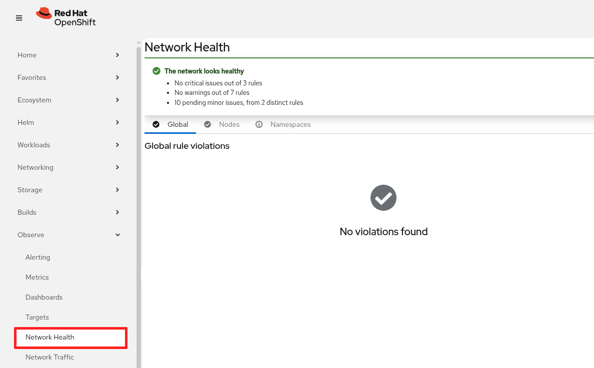<br>
Figure 5: Network Health Dashboard

At the top of the Network Health dashboard, it gives an overall summary of the network health.  Below that, there are three tabs named **Global**, **Nodes**, and **Namespaces**.  The **Global** tab shows the global rule violations (Figure 6).  In this screenshot, it reports "Too many DNS errors".

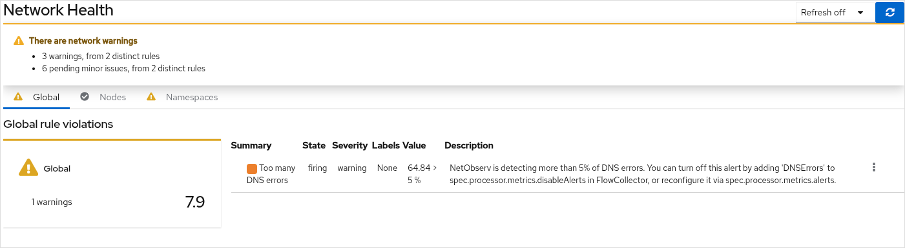<br>
Figure 6: Network Health - Global

The **Nodes** tab shows rule violations at the node level (Figure 7).  There are none in this screenshot.

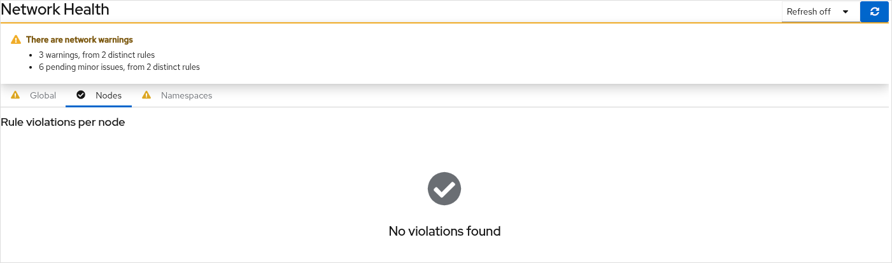<br>
Figure 7: Network Health - Nodes

The **Namespaces** tab shows rule violations at the namespace level (Figure 8).

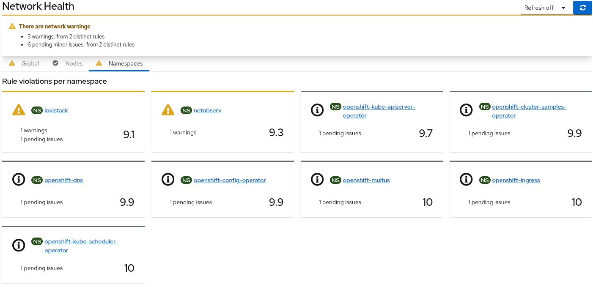<br>
Figure 8: Network Health - Namespaces

## Network Observability CLI 1.10

Network Observability CLI 1.10 gets a new facelift in this release.  While it's still a text-based user interface, you can now use the mouse to interact with the program!  It is an `oc` plugin that captures, displays, and saves flows, metrics, or packet information.

Follow the [installation instructions](https://docs.redhat.com/en/documentation/openshift_container_platform/4.20/html/network_observability/network-observability-cli#network-observability-cli-install_netobserv-cli-install) to set this up on your local computer.  It runs independent of whether you have Network Observability Operator installed or not.

Before you run the program, it's best to widen your terminal to 100+ characters and 40+ rows for a better display.  Then enter `oc netobserv` followed by one of `flows`, `metrics`, or `packets <filter>`.  Append `help` to the command to get online help.

I'll go over the three main modes and describe the changes in this release.  If you want the complete documentation, read the chapter on [Network Observability CLI](https://docs.redhat.com/en/documentation/openshift_container_platform/4.20/html/network_observability/network-observability-cli).

### Flows

To see the traffic flows table, enter `oc netobserv flows`, and add any other options to the command.  By default, it runs in dark mode (Figure 9).

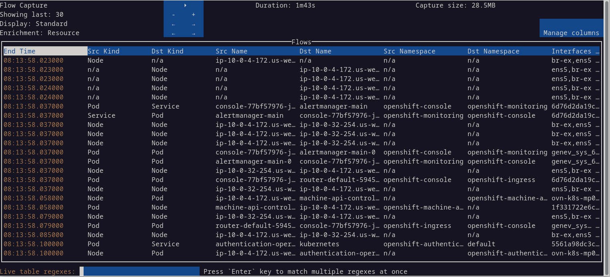<br>
Figure 9: Network Observability CLI - Flows

The blue square at the top has a number of controls.  The triangle is a new play/pause button that's accessible with the mouse.  This is a nice addition to be able to pause the data.  Note that while it's paused, data is still being collected.

Below the play/pause button are the "-" and "+" buttons.  Each row corresponds to decreasing or increasing the value on that same row.  Therefore, the first set of buttons decreases or increases how many rows to display.  The next row, **Display**, cycles through the eBPF features.  The last row, **Enrichment**, shows different columns.

The **Manage columns** button is new (Figure 10).  It lets you select a set of columns to display.  Select or deselect a column using the Enter key (not the mouse).

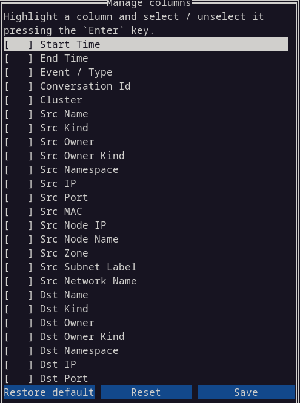<br>
Figure 10: Network Observability CLI - Manage columns

The filter field at the bottom of the screen was improved.  As you type into this field, it provides auto-suggestions in a dropdown choicelist (Figure 11).  You can also enter multiple filters.

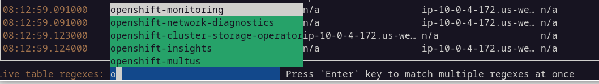<br>
Figure 11: Network Observability CLI - Filters

Use the tab key to toggle between the flows table and the filter field.  While in the table, you can move around using the `h`,`j`,`k`,`l` keys, for those of you who are familiar with vi!

Tip: Oftentimes, Network Observability CLI will exit before I am done.  To increase the time it runs, add the `--max-bytes` option such as `--max-bytes=500000000` (500 MB).  Of course, you will need to have enough disk space to store the temporary data.

### Metrics

To view the metrics, enter `oc netobserv metrics --enable_all` plus any other options to the command.  The `--enable_all` is optional and turns on all eBPF features.  Otherwise, many of the graphs will be blank.

In the previous release, you could only see graphs with the OpenShift web console.    Now there are text-based graphs!

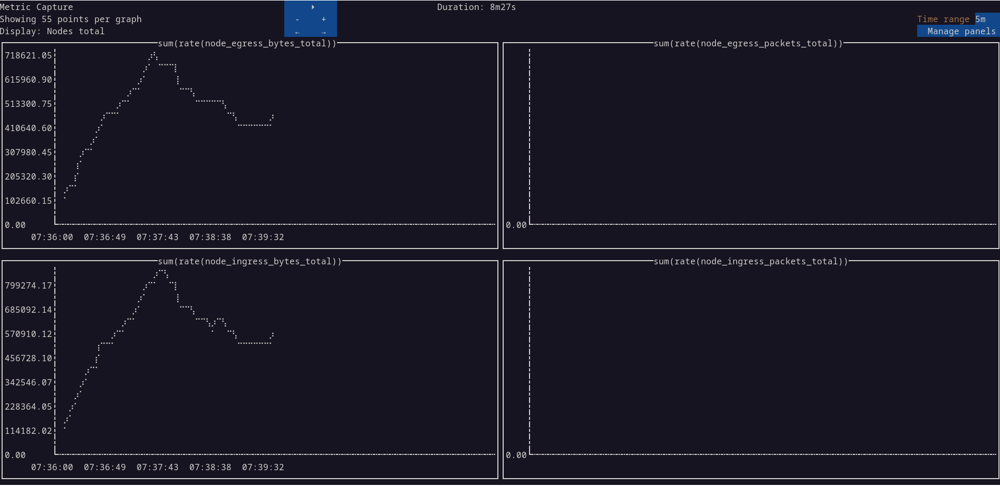<br>
Figure 12: Network Observability CLI - Metrics

In the blue box, you can increase or decrease the number of points in the graph by increments of 5.  You can also cycle through the different sets of graphs in the **Display** row.  If you want the OpenShift web console to display the graphs like before, add the `--background` option.

There is a **Manage panels** button that lets you choose the graphs you want to display (Figure 13).  Select or deselect a panel using the Enter key (not the mouse).

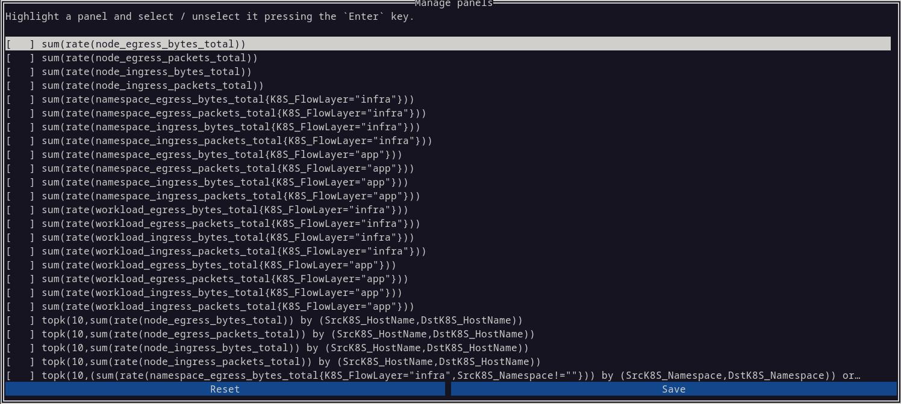<br>
Figure 13: Network Observability CLI - Manage panels

### Packets

To view packets, enter `oc netobserv packets <filter>`.  A filter is required such as `oc netobserv packets --port=443`.  If you want to inspect a packet, you can do that directly now without having to resort to an external tool like Wireshark (Figure 14).  Press tab to go to the table.  Move to the particular row and press Enter.

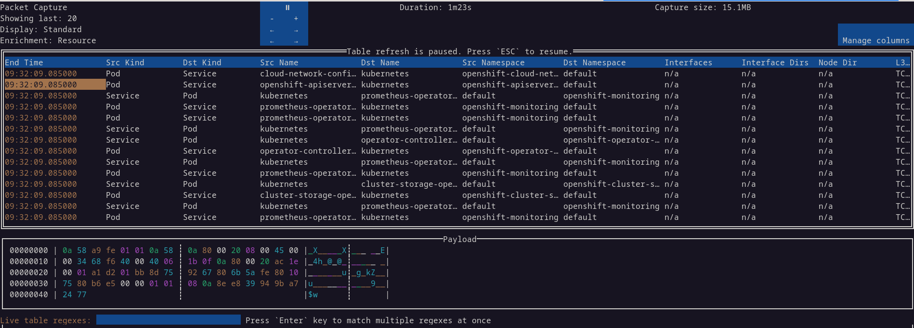<br>
Figure 14: Network Observability CLI - Packets

## Summary

In Network Observability CLI, there were significant improvements in the user interface and ease of use. The UI was completely revised and supports the mouse.  Columns in the flow table and selection of graphs to display for metrics are customizable.  It is now able to display graphs and packet captures without resorting to external programs.

In Network Observability, it is easier to create a FlowCollector and FlowMetric instance.  It is more secure with the use of network policies.  The custom alerts and Network Health Dashboard, while still in Technology Preview, are signs of things to come.  As we move beyond insights into analysis, give us feedback on this and other topics on the [discussion board](https://github.com/netobserv/network-observability-operator/discussions).

_Special thanks to Joel Takvorian, Julien Pinsonneau, and Amogh Rameshappa Devapura for reviewing this article._
