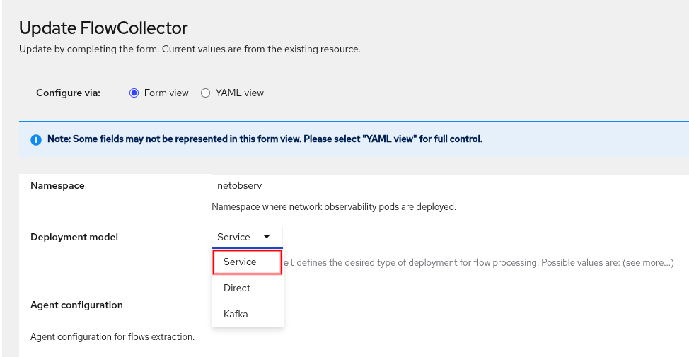
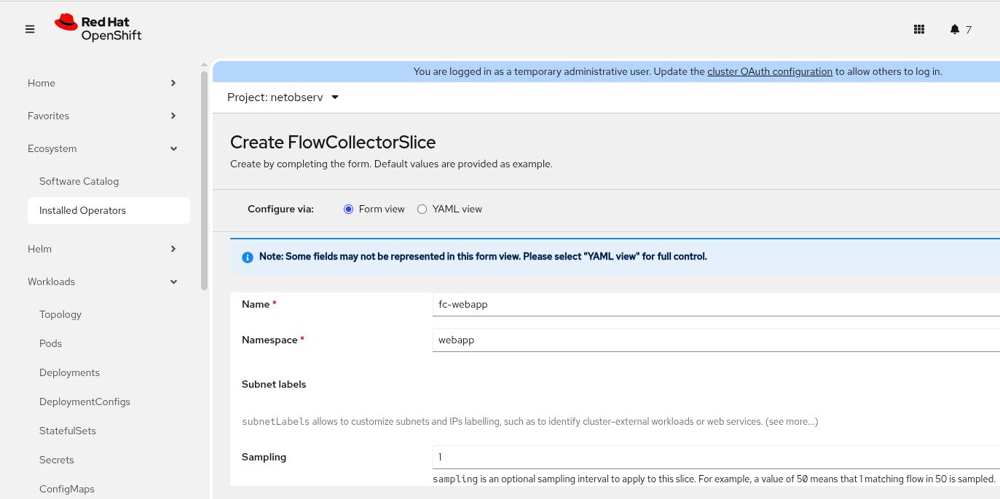
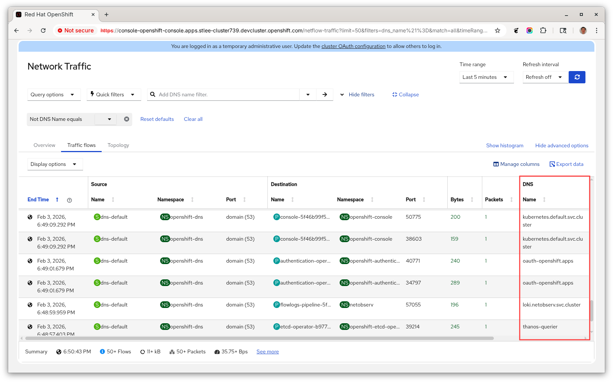
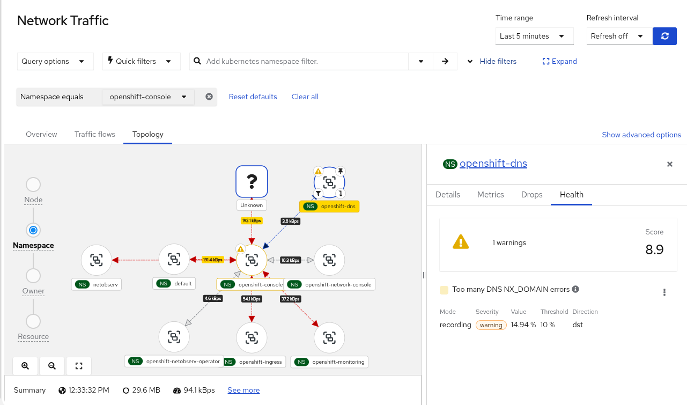
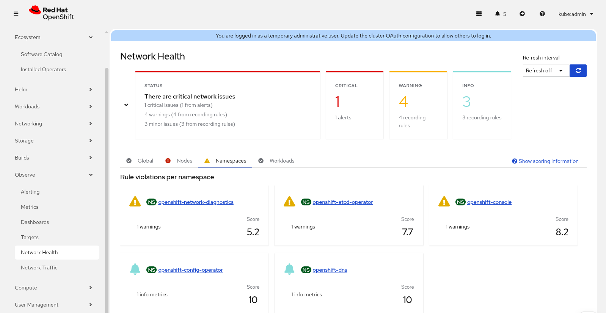
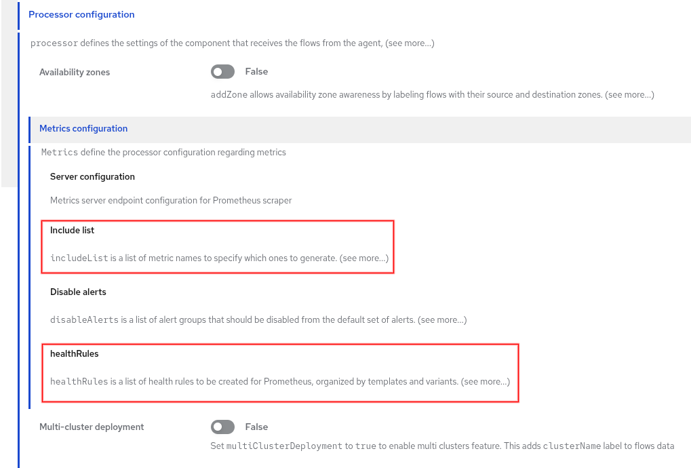
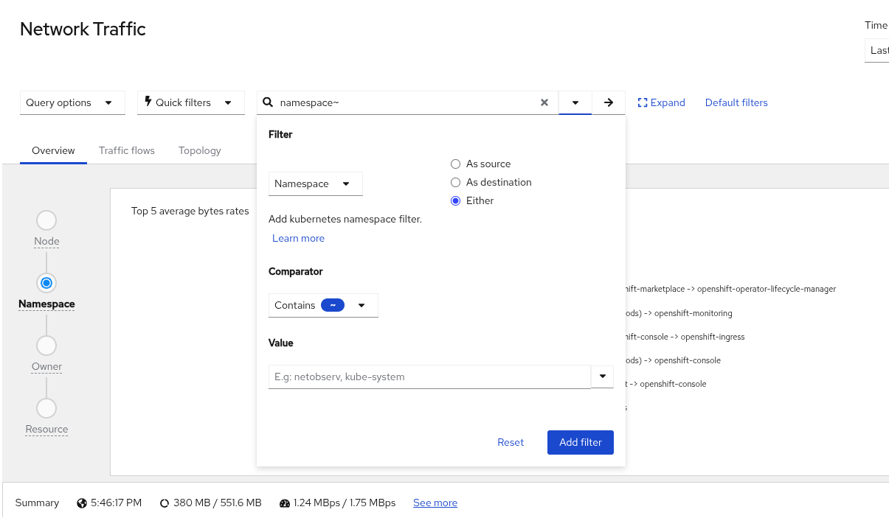
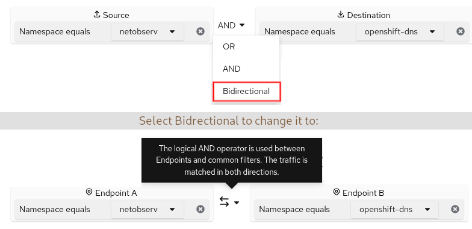
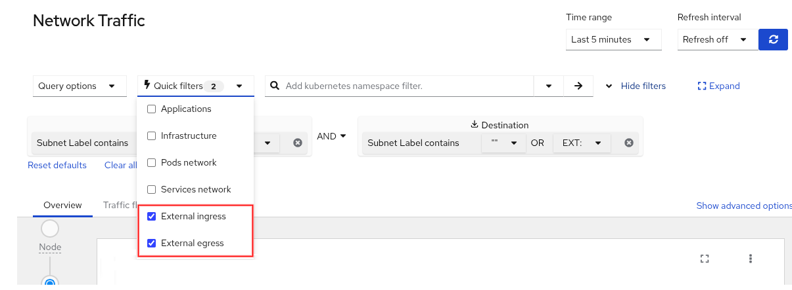
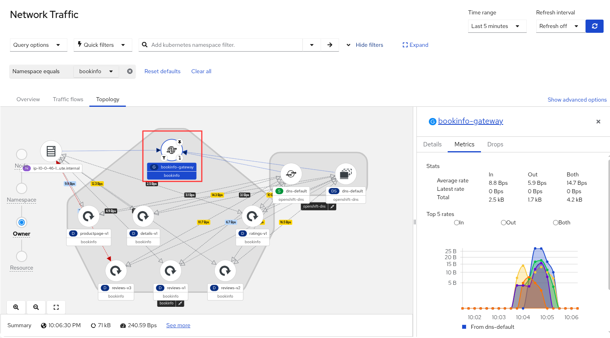

Welcome to another installment of **What's new in network observability**.  This article covers Network Observability 1.11, which was released in the same time frame as [Red Hat OpenShift Container Platform (OCP) 4.21](https://docs.redhat.com/en/documentation/openshift_container_platform/4.21).  However, it is also backwards-compatible with the older supported versions of OCP.  While there is an upstream version of Network Observability, I will focus on using it with OpenShift web console.

Network Observability provides insights to your network traffic across your entire cluster.  It collects and aggregates network flow data using eBPF technology.  The data is enriched with Kubernetes context and is stored in the form of Loki logs and/or Prometheus metrics.  You can visualize this in the form of graphs, tables, and a topology view.  It not only provides deep visibility but can help troubleshoot problems related to packet drops, latencies, DNS errors, and more.

To try this out, you need a Kubernetes cluster, preferably an OpenShift cluster,
and the `oc` or `kubectl` command line on your computer.  Follow the instructions to [install the Network Observability Operator](https://docs.redhat.com/en/documentation/openshift_container_platform/4.21/html/network_observability/installing-network-observability-operators).

This article highlights the new features in 1.11.  If you’re interested in earlier versions, see my previous [What’s new in network observability](https://developers.redhat.com/author/steven-lee) articles.  Below is a summary of the changes that are discussed in the rest of this article.

- Service deployment model
- FlowCollectorSlice CRD
- Zero-click Loki (demo)
- DNS name
- Improvements in network health
- Recording rules
- Enhanced filters
- Kubernetes Gateway object

## Service deployment model

Minimally, to get network observability running, you need to deploy a FlowCollector custom resource or instance.  In OpenShift web console, click **Ecosystem** (formerly **Operators** in OCP 4.19 or earlier) on the left-hand side.  Then click **Installed Operators**.  On the right side, click the **FlowCollector** link.  This brings up the FlowCollector Wizard.

In the **Deployment model** field, there is a new **Service** option.  It deploys FlowCollector using the Kubernetes Deployment method and allows you to specify the number of replicas to run (Figure 1).

<br>
Figure 1. The "Deployment model" field provides a new "Service" option.

The Service model is sort of in between the two existing models, Direct and Kafka.  The Direct model deploys as a DaemonSet, so it runs a flowlogs-pipeline pod on each node.  The Kafka model is just like the Service model, except it supports Apache Kafka for better scalability.  View the [architectural diagrams of each model](https://github.com/netobserv/network-observability-operator/blob/main/docs/Architecture.md#service-deployment-model) for more details.

The default setting is Service model with three flowlogs-pipeline pods.  You may need more pods if your cluster has heavy traffic or uses a low sampling interval (that is, samples more data).  For large clusters, it is still recommended to use the Kafka model.

## FlowCollectorSlice CRD

While the Service model allows you to specify the number of flowlogs-pipeline pods, you still don't have much control over what and how much packet data to ingest.  In 1.8, the eBPF flow filter feature allowed you to specify a CIDR, peer CIDR, and a sampling interval, but that is very low-level.  Instead, what we want is to be able to do this at the namespace level so that it can support multitenancy.

A new custom resource definition (CRD) named FlowCollectorSlice lets you define one or more instances that include a namespace and optionally a sampling value and a list of subnet labels.  A subnet label is simply a CIDR (e.g. 10.128.0.1/32) that's given a human-readable name.  If you think of a project (or tenant) that consists of one or more namespaces, then each project can set their own sampling value and labels.  Unlike the FlowCollector CRD, which is configured by the cluster-admin, a typical use case for FlowCollectorSlice is to give [RBAC](https://docs.redhat.com/en/documentation/openshift_container_platform/4.21/html/authentication_and_authorization/using-rbac) access to a non-admin user, such as a project admin, so they can configure a FlowCollectorSlice instance for their namespaces.

Before we dive into this, I want to point out that in OpenShift, there are at least two ways to configure something.  You can use the OpenShift web console and go to the appropriate panel and fill out a form.  You can also click the "**+**" at the top next to your username, select **Import YAML**, and paste YAML into the window.  Alternatively, you can run the `oc` command, such as `oc apply -f <file>` where *&lt;file&gt;* is the YAML file.  In some cases, I'll show both, but other times for brevity or simplicity, I will only show one method.

In Figure 2, it shows the form view in OpenShift web console on creating a FlowCollectorSlice.  You can get to this panel from **Ecosystem > Installed Operators**.  In the **Network Observability** row, click the **FlowCollectorSlice** link.

<br>
Figure 2. Create a FlowCollectorSlice instance.

Here is the YAML that is applied to my cluster.

```yaml
apiVersion: flows.netobserv.io/v1alpha1
kind: FlowCollectorSlice
metadata:
  name: fc-webapp
  namespace: webapp
spec:
  sampling: 1
  subnetLabels:
    - cidrs:
        - 172.30.40.45/32
      name: websvc
```

The FlowCollectorSlice instances won't take effect unless they are enabled in the FlowCollector.  In OpenShift web console, click **Processor configuration** and then **Slices configuration** to configure this.  Alternatively, on the terminal, enter `oc edit flowcollector`, and configure the following under the **processor** section:

```yaml
spec:
  processor:
    slicesConfig:
      enable: true
```

What makes this really powerful is that the FlowCollector can be configured to only ingest data for a list of namespaces.  Here is an example to only ingest data for namespaces that are named "webapp" or begin with "openshift-".

```yaml
spec:
  processor:
    slicesConfig:
      enable: true
      collectionMode: AllowList  # default: AlwaysCollect
      namespacesAllowList: [webapp, /^openshift-/]
```

The **collectionMode** must be set to `AllowList` for **namespacesAllowList** to take effect.  The first element of **namespacesAllowList** is an exact match for `webapp`.  The second element specifies a regular expression because it's between the forward slashes.

## Zero-click Loki (demo)

If you want to test Network Observability with Loki enabled, you still have to create a Loki instance and provide storage.  The zero-click Loki feature adds a new parameter, **installDemoLoki**, which when set to `true`, creates a Loki in monolithic mode and a Persistent Volume Claim (PVC).  If using OpenShift web console, this is the third page (Loki) of the FlowCollector Wizard.  Set the **Mode** to `Monolithic` and enable **installDemoLoki**.  Here is how you do it with YAML.

```yaml
spec:
  loki:
    monolithic:
      installDemoLoki: true
```

The PVC is 10 GiB of ephemeral storage.  Now you're able to get a running Network Observability to try out instantly!  As the parameter name indicates, *use this only for demo purposes and not production*, since monolithic Loki will not scale.

## DNS name

Network Observability can track DNS information if the `DNSTracking` feature is enabled.  In OpenShift web console, this is in the **Agent configuration** section of the FlowCollector form or the second page of the FlowCollector Wizard (Figure 1).  Here is the YAML configuration below.

```yaml
spec:
  agent:
    ebpf:
      features:
        - DNSTracking
```

It now retrieves the DNS name.  Technically, in a DNS query, it is the QNAME field.  In OpenShift web console, go to **Observe > Network Traffic** and click the **Traffic flows** tab.  Click **Show advanced options** and then **Manage columns**.  Scroll down and enable `DNS Name` to add this column.  Now you will see this column (Figure 3).

<br>
Figure 3. This is the Traffic flows table with the DNS Name column.

In the **Overview** tab, there is also a new "Top 5 DNS name" graph.

DNS Name is also supported in the [Network Observability CLI](https://mirror.openshift.com/pub/cgw/netobserv/latest/), a command line tool based on the network observability code base.  There is a current limitation of storing only the first 30 characters of the DNS name.

## Improvements in network health

Network Health dashboard and custom alerts reached General Availability (GA) in this release.  It removes the feature gate environment variable that was mentioned in the [1.10 article](https://developers.redhat.com/articles/2025/12/17/whats-new-network-observability-110?source=sso#technology_preview_of_custom_alerts).

The health violations were also integrated into the topology view in the **Observe > Network Traffic** panel under the Topology tab.  Select an object to view the details, and if there are any violations, there will be a Health tab (Figure 4).

<br>
Figure 4. The Topology view shows the health violation in the namespace scope.

## Recording rules

Custom alerts create a PrometheusRule object (from monitoring.coreos.com/v1) that is tied into the OpenShift alert system.  This is great if the alert is well-defined to avoid false positives and not generating yet another alert for the same problem.  This is sometimes hard to avoid and the notion of alert fatigue is very real and problematic.

Network Observability now supports the recording rule in PrometheusRule.  It is a PromQL expression that is precomputed regularly and then stored as a new metric.  From a user point-of-view, it is like an alert, except it only appears in the Network Health dashboard and doesn't fire any events (Figure 5).

<br>
Figure 5. The Network Health dashboard shows rule violations for recording rules and alerts.

In OpenShift web console, in the FlowCollector form, click **Processor configuration** and then **Metrics configuration**.  The two relevant sections are **include list** and **healthRules** (Figure 6).

<br>
Figure 6. Configure recording rules in the healthRules section.

Both the recording rules and alerts fall under the umbrella of **healthRules**.  When you select a template for a health rule, you will also need to include the corresponding metric.  That is done in the **include list** section.  Don't worry; a warning will appear if you didn't include the necessary metric.  For the DNS-related health rule, you also need to enable the `DNSTracking` feature in eBPF.

To configure this on the terminal, enter `oc edit flowcollector`, and look for the **metrics** section.  Example:

```yaml
spec:
  processor:
    metrics:
      healthRules:
        - template: DNSNxDomain
          mode: Alert  # Alert (default) or Recording
          variants:
            - groupBy: Namespace
              mode: Recording  # override parent's mode
              thresholds:
                warning: "10"
                info: "5"
            - groupBy: Node
              # mode not specified so it uses parent's mode
              thresholds:
                critical: "15"
```

The **mode** field determines whether it's a recording rule or alert.  This is configured under **healthRules** or **variants**.  If it is specified in **variants**, it overrides the setting in **healthRules**.  For more details on health rules, including how to adjust the thresholds, view the [runbooks](https://github.com/openshift/runbooks/tree/master/alerts/network-observability-operator) for Network Observability Operator.

## Enhanced filters

### UI filters

Previously, in the **Network Traffic** panel, the filter fields were made up of three separate UI components.  They were the field name, operator, and value (e.g. Source Name = netobserv).  It is now a single field that make up this *&lt;field&gt;&lt;operator&gt;&lt;value&gt;* expression.  Start typing into this field and it provides suggestions for you.  It works best if you don't put a space before or after the operator.  If you want more guidance on creating the filter expression, click the small triangle to the right of the text field to bring up a dialog (Figure 7).

<br>
Figure 7. The filter dialog appears when you click the small triangle.

The dialog is mostly self-explanatory, so I won't get into details.  The right arrow, next to the small triangle, is the button you click after entering the filter expression.  You can also just press Enter.  This adds the filter expression with any other filters you might already have below this field.

You are able to make changes to the configured filter expressions, including changing the field value.  For example, suppose you have "Namespace equals netobserv".  The "Namespace" means source or destination namespace.  Click the dropdown for "netobserv" and select **As source**.  This changes the field to be Source Namespace only.  Changing the field value might move the entire expression to a new location, because you can't have the same field name repeated twice in the entire expression.

A field name with multiple values means it must match any one of the values (*OR* condition).  In between the fields is typically an *AND* condition but can be changed to *OR*.  There's a special case where *Bidirectional* might be a choice.  For example, suppose you have "Source Namespace equals netobserv" *AND* "Destination Namespace equals openshift-dns".  If you change *AND* to *Bidirectional*, then it also includes the traffic when the source and destination are swapped.  For the UI, the Source and Destination labels change to **Endpoint A** and **Endpoint B** respectively (Figure 8).

<br>
Figure 8. This is how the UI is changed when you specify Bidirectional between two filter expressions.

### Quick filters

Quick filters are predefined filters in the **Network Traffic** panel.  Two new filters were added in this release, namely **External ingress** and **External egress** (Figure 9).

<br>
Figure 9. This shows the two new Quick filters.

"External ingress" is traffic where the source is outside of the cluster and the destination is an endpoint inside your cluster.  If you deploy a web server and access this server from the outside, in OpenShift, this creates two flows, one from the outside to an HAProxy pod named *router-default-&lt;hash&gt;* and a second flow from the HAProxy pod to your web server.  The second flow is NOT considered external ingress traffic.

Similarly "External egress" is the traffic where the source is inside the cluster and the destination is outside of the cluster.  Again, there is an HAProxy in between and so the second flow that goes outside of the cluster is only considered external egress traffic.

How does this actually work?  It leverages subnet labels.  There's a parameter under **spec.processor.subnetLabels** named **openShiftAutoDetect** that must be set to `true`, which is the default.  This identifies all CIDRs with a predefined value such as **Pods**, **Services**, **Machines**, **n/a**, or a custom name that you give it.  The default value for an external CIDR is blank.  If you give it a custom name, you must prefix it with **EXT:** (notice the colon) in order for the quick filter to work.  Why?  Because if you look at the implementation of the quick filter, it is:

```yaml
    - filter:
        src_subnet_label: '"",EXT:'
      name: External ingress
    - filter:
        dst_subnet_label: '"",EXT:'
      name: External egress
```

If the subnet label name is blank or **EXT:**, then it is considered external traffic.

## Kubernetes Gateway object

Network Observability recognizes the Kubernetes Gateway object.  The owner of a pod is often times a Deployment, but if the owner of the Deployment is a Gateway, such as if [Red Hat OpenShift Service Mesh 3](https://www.redhat.com/en/technologies/cloud-computing/openshift/what-is-openshift-service-mesh) or Istio is installed, then Network Observability will show this owner object with a gateway icon instead (Figure 10).  To view the Gateway traffic, it provides a link to the Gateway resource page.

<br>
Figure 10. The Topology view shows a gateway icon.

Speaking of icons, they've been refreshed and updated to better represent the Kubernetes objects.

## Summary

This release provides features that give you better control on how resources are used with the Service deployment model and the new FlowCollectorSlice CRD.  There were improvements to the Network Health dashboard and support for recording rules.  Usability enhancements were made in the UI filters, along with a zero-click Loki setup for demonstration purposes.  Finally, the DNS name was added and the Kubernetes Gateway object is now recognized.

We want to make a bigger push to serve the community, so if there's something on your wishlist, go to the [discussion board](https://github.com/netobserv/network-observability-operator/discussions), and let us know what you have in mind!  Until next time...

_Special thanks to Julien Pinsonneau, Olivier Cazade, Amogh Rameshappa Devapura, Leandro Beretta, Joel Takvorian, and Mehul Modi for reviewing this article._
