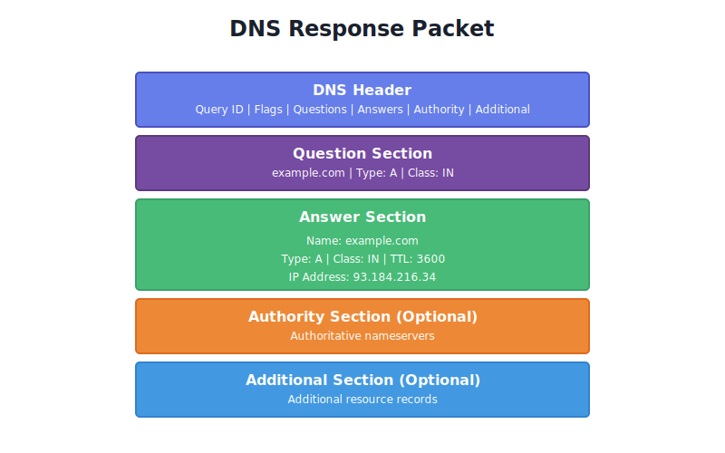
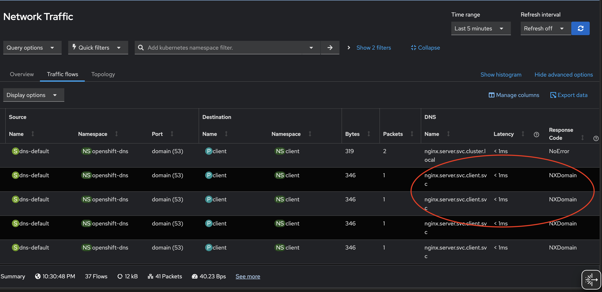
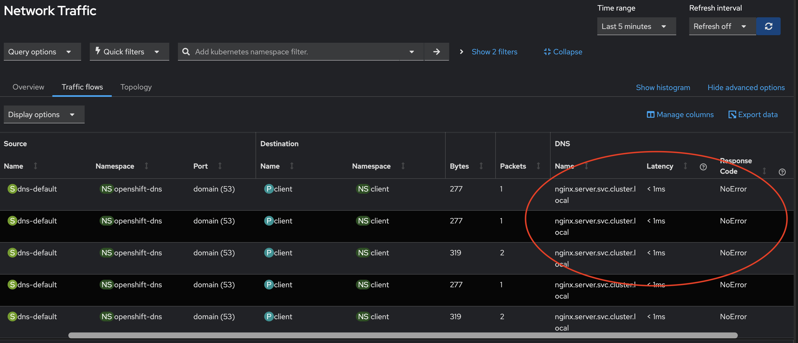
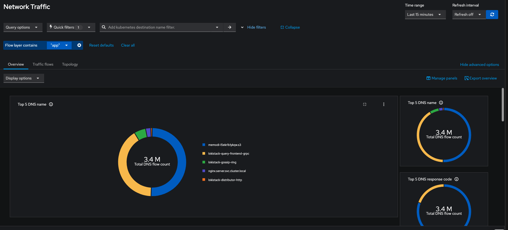

Network Observability has long had a feature that reports the DNS latencies and
response codes for the DNS resolutions in your Kubernetes cluster. `DNSTracking`
feature can be simply enabled in FlowCollector config as below.

```yaml
spec:
  agent:
    ebpf:
      features:
      - DNSTracking
```

In the most recent 1.11 release, a major enhancement was added to existing
`DNSTracking` feature to report DNS query names as well without any additional
configuration to the FlowCollector.

The current implementation captures DNS latencies, response codes, and query
names from DNS response packets. To understand this better, let's examine the
structure of a standard DNS response packet:



As you may have guessed DNS query name is being captured from the Question
section of a response packet. DNS resolution is the first step for most
application network requests in Kubernetes. In this blog, let us demonstrate how
having this information could help you troubleshoot configuration issues or
could help you identify DNS configuration issues and detect suspicious network
activity.

We're running an OpenShift cluster on AWS with a simple test setup: a `client`
pod making requests to an `nginx` service in a different namespace. The nginx
service runs in the `server` namespace, while the client pod runs in the
`client` namespace."

```bash
 while : ; do
    curl nginx.server.svc:80/data/100K  2>&1 >  /dev/null
    sleep 5
 done
```

While the requests to fetch 100K object does succeed, can you spot the
configuration issue in the above curl command for the nginx requests that its
making? Let's look at what we do see in the flowlogs:



We see several requests failing due to `NXDOMAIN` response code and the ones
that succeed have query names `nginx.server.svc.cluster.local`. Since we
configured short DNS name `nginx.server.svc` in the curl command, the cluster
DNS service tries multiple search paths to find answer based on /etc/resolv.conf
search directive.

```bash
cat /etc/resolv.conf
search server.svc.cluster.local svc.cluster.local cluster.local us-east-2.compute.internal
nameserver 172.30.0.10
options ndots:5
```

Short DNS names for cluster services causes high load on the cluster DNS service
resulting in higher latencies, negative caching and increased dns traffic. This
negative impact can be prevented by using Fully Qualified Domain Name (FQDN) in
the requests. After updating the hostname to `nginx.server.svc.cluster.local.`
in the curl requests, we are not seeing any NXDOMAINS and reduced unnecessary
dns traffic in our cluster. You can imagine the performance impact if such
configuration issue propagated to hundreds of services in your cluster.



The web console also has new Overview Panels to fetch top 5 DNS names which are
queried most:



Note that `pod` filters are removed in above image since the DNS traffic is
reported by the DNS `Service` in the cluster. This visualization can identify
suspicious domain name activities in your cluster and with table view you can
narrow down to the resource where such activities could be coming from.

While DNS name decoding has great use-cases in identifying and troubleshooting
issues, it comes with some caveats to favor performance. This feature isn't
supported with Prometheus as datastore since storing DNS names as metric values
could cause high cardinality. That means, if you're looking to use this feature
you must use Loki as your datasource. Captured DNS names will be truncated at 32
bytes to balance the netobserv-ebpf-agent's memory utilization, however
this length should cover most practical scenarios.

DNS name tracking currently does not support DNS compression pointers — a
space-saving technique defined in
([RFC 1035 section 4.1.4](https://www.rfc-editor.org/rfc/rfc1035.html#section-4.1.4)).
While this is a known limitation, it has minimal practical impact since
compression is rarely used in the Question section where queries are tracked.
Compression pointers are predominantly used in Answer sections to reference the
queried domain name.

In combination with other Network Observability features such as built in alerts
for overall network health, DNS name tracking will help identify real world
issues faster. Before we wrap up, we'd like to acknowledge <__add
acknowledgements__>.

If you'd like to share feedback or engage with us, feel free to ping us on
[slack](https://cloud-native.slack.com/archives/C08HHHDA9ND) or drop in a
[discussion](https://github.com/orgs/netobserv/discussions).


Thank you for reading!
