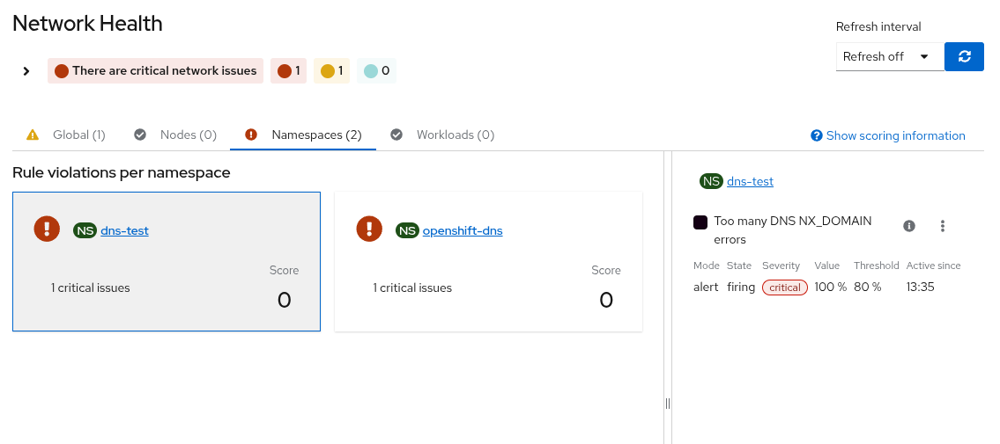
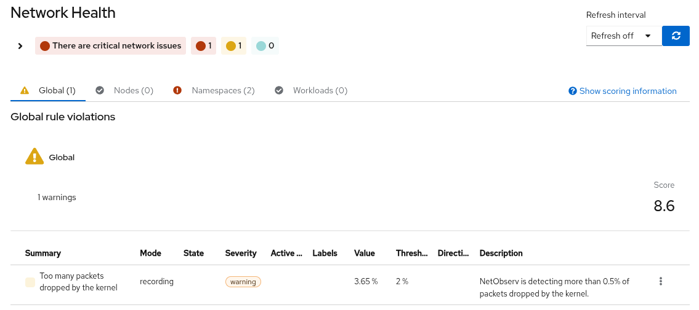
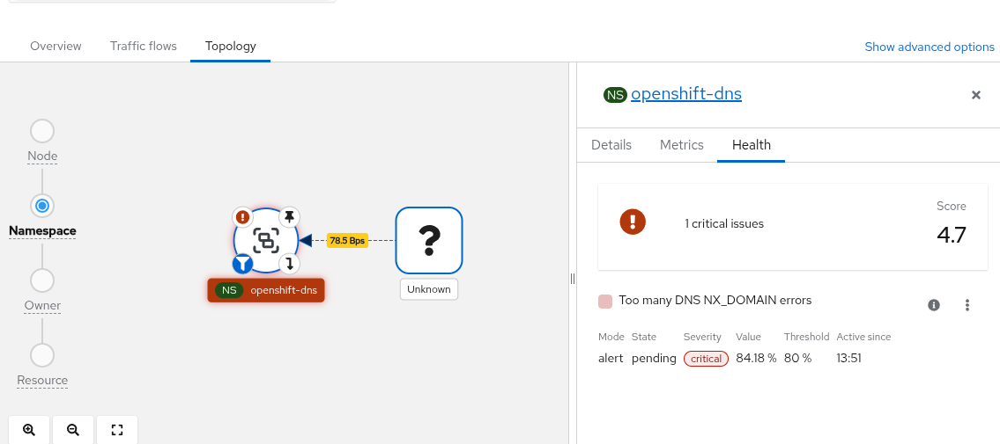
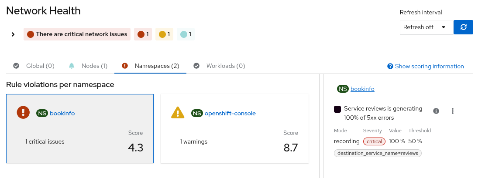
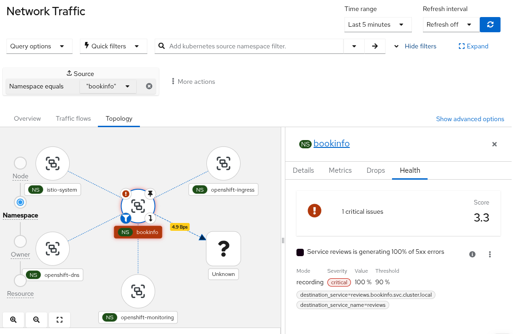

_Thanks to: Joel Takvorian, Steven Lee and Mehul Modi for reviewing_

Understanding the health of your cluster network is not always straightforward. Issues like packet drops, DNS failures, or policy denials often require digging through multiple dashboards, metrics, or logs before you can even identify where the problem is.

**Network Health in NetObserv aims to simplify this** by surfacing these signals in a single, unified view. NetObserv now features a dedicated **Network Health** section designed to provide a high-level overview of your cluster's networking status. This interface relies on a set of predefined health rules that automatically surface potential issues by analyzing NetObserv metrics.

Out of the box and **assuming the specific eBPF feature is enabled**, these rules monitor several key signals such as:

- **DNS errors and NXDOMAIN responses** (requires `DNSTracking: true`)
- **Packet drops** (requires `PacketDrop: true`)
- **Network policy denials** (enabled by default)
- **Latency trends** (requires `FlowRTT: true`)
- **Ingress errors** (enabled by default)

These built-in rules provide immediate diagnostic value without requiring users to write complex PromQL queries. Rules are only created when their corresponding eBPF feature is enabled in the FlowCollector configuration.

At the same time, real-world environments often require more tailored definitions of health. What is considered “healthy” for one workload might not apply to another.

This is where Network Health becomes particularly powerful: it allows you to define **custom health rules** tailored to the specific behavior and expectations of your applications.

The dashboard is organized by scope: **Global**, **Nodes**, **Namespaces**, and **Workloads**. The tab counts show how many items you have in each scope, so you know at a glance where to look.

You can find Network Health in the NetObserv console (standalone or OpenShift at **Observe > Network Traffic**).

The following images describe some health rules in two different scopes:


*Alert rule showing as pending or firing in the dashboard at the Namespace scope*


*Recording rule continuously tracking metric values across severity thresholds at the Global scope*

## Understanding Health Rules: Alerts vs Recording Rules

Behind the scenes, the Network Health section is powered by **PrometheusRule** resources. The **PrometheusRule** supports two different rule modes, each designed for a different monitoring strategy.

### Alert mode

**Alert rules** trigger when a metric exceeds a defined threshold.

For example: *Packet loss > 10%*

These rules are useful for detecting immediate issues that require action, and they integrate with the existing Prometheus and Alertmanager alerting pipeline. In the Network Health dashboard, alert rules appear when they are **pending** (before the threshold is sustained) or **actively firing**.

### Recording mode

**Recording rules** compute and store metric values in Prometheus without generating alerts. They appear in the dashboard as soon as values reach the configured thresholds (*info*, *warning*, or *critical*), making them ideal for tracking trends and reducing alert fatigue.

### When to use each

In practice:

- Use **alert rules** when you need to be notified of immediate issues  
- Use **recording rules** when you want issues reflected in health monitoring without involving the alerting pipeline

For Network Health, recording rules are often a better fit, as they allow you to observe degradation trends before they become critical.

## Configuring the Built-in Health Rules

NetObserv includes predefined health rules that are automatically enabled when their required features are active. You can customize these rules to match your cluster's specific needs.

### Available Built-in Rules

| Rule Name | Monitors | Required Feature | Default Threshold |
|-----------|----------|------------------|-------------------|
| `DNSErrors` | DNS query failures | `DNSTracking: true` | Critical: >10% |
| `DNSNxDomain` | NXDOMAIN responses | `DNSTracking: true` | Warning: >5% |
| `PacketDropsByDevice` | Interface-level drops | `PacketDrop: true` | Critical: >5% |
| `PacketDropsByKernel` | Kernel-level drops | `PacketDrop: true` | Critical: >5% |
| `IPsecErrors` | IPsec encryption failures | Default flows | Warning: >1% |
| `NetpolDenied` | Network policy denials | Default flows | Info: >10/min |
| `LatencyHighTrend` | RTT latency increases | `FlowRTT: true` | Warning: +50ms trend |
| `Ingress5xxErrors` | HTTP 5xx responses | Default flows | Critical: >5% |
| `IngressHTTPLatencyTrend` | HTTP latency increases | Default flows | Warning: +200ms trend |

**Note:** Rules are only created if their required eBPF feature is enabled in the FlowCollector configuration.

### Adjusting Thresholds

You can override default thresholds via the FlowCollector custom resource:

```yaml
apiVersion: flows.netobserv.io/v1beta2
kind: FlowCollector
metadata:
  name: cluster
spec:
  agent:
    ebpf:
      features:
        - DNSTracking      # Required for DNS rules
        - FlowRTT          # Required for latency rules
        - PacketDrop       # Required for packet drop rules
  
  processor:
    metrics:
      healthRules:
        # Customize DNSErrors rule
        - template: DNSErrors
          mode: Alert              # Can be Alert or Recording
          variants:
            # Global threshold (no grouping)
            - thresholds:
                critical: "15"     # Increased from default 10%
                warning: "8"       # Added warning level
            
            # Per-namespace threshold with multiple severity levels
            - thresholds:
                critical: "20"
                warning: "10"
                info: "5"
              groupBy: Namespace
        
        # Customize PacketDropsByKernel as Recording rule
        - template: PacketDropsByKernel
          mode: Recording          # Continuous tracking, no alerts
          variants:
            - thresholds:
                critical: "8"      # Increased from default 5%
                warning: "5"
                info: "3"
              groupBy: Node
```

**Important:** When you configure a template, it **replaces** the default configuration. To add a variant while keeping the defaults, you must include the default variant in your configuration.

### Disabling Rules

If certain rules don't apply to your environment, you can disable them:

```yaml
spec:
  processor:
    metrics:
      disableAlerts:
        - DNSNxDomain        # Disable if NXDOMAIN is expected
        - NetpolDenied       # Disable if policies are intentionally restrictive
```

**Note:** If a rule is both disabled (via `disableAlerts`) and configured (via `healthRules`), the disable setting takes precedence.

Each built-in rule template can operate in one or both modes, configurable at the template level or per-variant.

**How to configure modes:**

You can set `mode` at the **template level** (applies to all variants):

```yaml
healthRules:
  - template: DNSErrors
    mode: Alert              # All variants will be alerts
    variants:
      - thresholds:
          critical: "15"
      - thresholds:
          warning: "10"
        groupBy: Namespace
```

**Or** set `mode` at the **variant level** (takes precedence over template-level):

```yaml
healthRules:
  - template: DNSErrors
    mode: Alert              # Default mode for variants without explicit mode
    variants:
      - thresholds:          # Variant 1: Alert (inherits from template)
          critical: "15"
      
      - mode: Recording      # Variant 2: Recording (overrides template)
        thresholds:
          critical: "20"
          warning: "10"
          info: "5"
        groupBy: Namespace
```

This creates **two health rules** from the same template:
- One **alert rule** for global DNS errors
- One **recording rule** for per-namespace DNS errors

**For custom rules:** You can create separate PrometheusRule resources - one alert and one recording - monitoring the same metric. They will appear as **separate health rules** in the dashboard.

### Runbooks and Troubleshooting

Each built-in health rule comes with a **detailed runbook** that includes:
- What the rule monitors and why it matters
- Common root causes
- Step-by-step investigation procedures
- Resolution recommendations
- Links to relevant documentation

**Accessing Runbooks:**
1. In the Network Health dashboard, click on any violation
2. Click "View runbook" in the rule details panel
3. Or view all runbooks at: [NetObserv Runbooks](https://github.com/openshift/runbooks/tree/master/alerts/network-observability-operator)

For complete configuration details, see the [Health Rules documentation](https://github.com/netobserv/netobserv-operator/blob/main/docs/HealthRules.md).

## Health in the topology

Network Health is also integrated with the **Topology** view.

When you select a node, namespace, or workload, the side panel can display a **Health** tab if there are active violations. This allows you to move seamlessly from a high-level signal (for example, “this namespace has DNS issues”) to a contextual view of the affected resources.


*Topology side panel showing health violations for a selected resource*

## Configuring custom health rules

Custom health rules can be integrated into the Network Health dashboard by creating a **PrometheusRule** resource.

You can define:

- **custom alert rules**
- **custom recording rules**
- or a combination of both  

The way metadata is attached differs between alert and recording rules, as the CRD treats them differently.

### Custom alerts

Alert rules allow annotations directly on each rule. This is where you define:

- `summary`
- `description`
- optionally `netobserv_io_network_health`

The `netobserv_io_network_health` annotation contains a JSON string describing how the signal should appear in the dashboard (unit, thresholds, scope, etc.).

### Custom recording rules

Recording rules do not support annotations at the rule level. Instead, NetObserv requires a single annotation on the **PrometheusRule metadata**:

`netobserv.io/network-health`

This annotation is a JSON object that acts as a map:

- **keys** → metric names (matching the `record:` field)  
- **values** → metadata (summary, description, thresholds, etc.)  

Each recorded metric must have a corresponding entry in this map, as this is how Network Health associates metadata with the metric.

In both cases, you must include the label:

```yaml
netobserv: "true"
```

on both the `PrometheusRule` and each rule’s `labels`.

## How to Create and Test Custom Rules

Creating custom health rules involves several steps. Here’s a practical workflow:

### Step 1: Identify What to Monitor

Determine the metric and threshold that indicates a health issue:
- What metric indicates the problem? (e.g., `istio_requests_total`)
- What value indicates unhealthy state? (e.g., 5xx responses > 5%)
- What scope? (global, per-namespace, per-workload)

### Step 2: Test the PromQL Query

**Before creating the PrometheusRule**, validate your PromQL query in Prometheus:

1. Open the Prometheus UI (or OpenShift Observe → Metrics)
2. Test your query interactively. For example, to calculate 5xx error rate per service:

`(sum(rate(istio_requests_total{{reporter="source", response_code=~"5.."}}[5m])) by (destination_service_name, destination_service_namespace) / sum(rate(istio_requests_total{{reporter="source"}}[5m])) by (destination_service_name, destination_service_namespace) * 100)`

3. Verify the query returns expected results
4. Check the labels in the output - these will be used in `summary` and `description`

💡 **Tip:** Use the Query Browser to see what labels are available: click on any metric result to inspect its labels.

### Step 3: Choose Rule Mode

Decide between **Alert** or **Recording** rule:

| Use Alert if... | Use Recording if... |
|----------------|---------------------|
| You want Alertmanager notifications | You want to avoid alert fatigue |
| The issue requires immediate action | You’re tracking trends over time |

**Can you use both?** Yes! You can create a recording rule for continuous tracking AND an alert rule that triggers only when critical. Example:

```yaml
# Recording rule: track continuously
- record: service_5xx_rate_percent
  expr: (rate(errors[5m]) / rate(requests[5m])) * 100

# Alert rule: fire only when critical
- alert: Service5xxHigh
  expr: service_5xx_rate_percent > 10
  for: 5m  # Must stay above threshold for 5 minutes
```

### Step 4: Build the PrometheusRule YAML

Use this template:

```yaml
apiVersion: monitoring.coreos.com/v1
kind: PrometheusRule
metadata:
  name: my-custom-rule          # ← Your rule name
  namespace: netobserv           # ← Or your preferred namespace
  labels:
    netobserv: "true"            # ← REQUIRED (must be quoted)
  annotations:
    # For RECORDING rules, metadata goes here
    netobserv.io/network-health: |
      {
        "my_metric_name": {      # ← Must match record: field below
          "summary": "...",
          "description": "...",
          "netobserv_io_network_health": "{...}"
        }
      }
spec:
  groups:
    - name: MyRuleGroup
      interval: 30s              # ← How often to evaluate
      rules:
        - record: my_metric_name # ← Recording rule
          # OR
          # alert: MyAlertName    # ← Alert rule
          
          expr: |                # ← Your PromQL query (tested in Step 2)
            your_promql_here
            
          labels:
            netobserv: "true"    # ← REQUIRED (must be quoted)
            # For alerts only:
            # severity: critical  # ← critical, warning, or info
            
          # For ALERT rules, metadata goes here
          annotations:
            summary: "..."
            description: "..."
            netobserv_io_network_health: ‘{{...}}’
```

**Important Label Requirements:**

The label `netobserv: "true"` is **required** and the value **must be quoted**:

✅ Correct:
```yaml
labels:
  netobserv: "true"
```

❌ Incorrect (will not work):
```yaml
labels:
  netobserv: true    # Boolean - won’t be recognized
```

This applies to **both**:
- PrometheusRule metadata labels
- Individual rule labels within the spec

### Step 5: Configure the Health Metadata

The `netobserv_io_network_health` annotation is a JSON string with these fields:

#### Basic Display Fields

**`unit`** - The display unit for the metric value
- Examples: `"%"`, `"ms"`, `"bytes/sec"`, `"requests/min"`
- Use `""` (empty string) for dimensionless numbers
- This only affects display, not calculations

```json
"unit": "%"          // Shows as "12.5%"
"unit": "ms"         // Shows as "85ms"
"unit": ""           // Shows as "42"
```

**`upperBound`** - Maximum expected value for scoring calculations
- Used to compute health scores on a closed scale [0-10]
- **Must be a quoted string**, even though it’s a number: `"100"`, not `100`
- Metric values above this bound are clamped for scoring purposes
- Doesn’t prevent values from exceeding it, just affects score calculation

```json
"upperBound": "100"   // For percentages (0-100%)
"upperBound": "1000"  // For milliseconds (0-1000ms expected)
"upperBound": "10"    // For rate metrics (0-10/sec expected)
```

**Why must numbers be quoted?**  
JSON embedded in YAML annotations requires string values to avoid parsing issues. Using `"100"` is more reliable than `100`.

#### Scope Fields (determines which tab)

**`namespaceLabels`** - Array of label names containing namespace
- Rule appears in **Namespaces** tab
- Use the label name from your PromQL query results

```json
"namespaceLabels": ["namespace"]           // Standard Kubernetes label
"namespaceLabels": ["destination_namespace"] // Istio label
"namespaceLabels": ["k8s_namespace"]       // Custom label
```

**`nodeLabels`** - Array of label names containing node name
- Rule appears in **Nodes** tab

```json
"nodeLabels": ["node"]
"nodeLabels": ["instance"]
```

**`workloadLabels`** + **`kindLabels`** - Workload name and type
- **Both required** for **Workloads** tab
- `workloadLabels`: pod/deployment/statefulset name
- `kindLabels`: resource type (Pod, Deployment, StatefulSet, etc.)

```json
"workloadLabels": ["pod"],
"kindLabels": ["owner_kind"]
```

**Note:** `namespaceLabels`, `nodeLabels`, and `workloadLabels` are mutually exclusive for scope. If none provided, rule appears in **Global** tab.

#### Threshold Fields (mode-specific)

**For Alert rules only:**

```json
"threshold": "10"    // Must match the threshold in your alert expr
                     // Example: expr: my_metric > 10
```

**For Recording rules only:**

```json
"recordingThresholds": {
  "info": "5",       // Shows as blue/info when value ≥ 5
  "warning": "10",   // Shows as orange/warning when value ≥ 10
  "critical": "20"   // Shows as red/critical when value ≥ 20
}
```

All threshold values are **quoted strings**.

#### Complete Metadata Example

Here’s a complete example with all fields:

```yaml
annotations:
  # Use single quotes to avoid escaping internal double quotes
  netobserv_io_network_health: ‘{
    "unit": "%",
    "upperBound": "100",
    "namespaceLabels": ["destination_service_namespace"],
    "workloadLabels": ["destination_service_name"],
    "recordingThresholds": {
      "info": "1",
      "warning": "5",
      "critical": "10"
    }
  }’
```

**Best Practice:** Use **single quotes** around the entire JSON value to avoid escaping every internal double quote:

```yaml
# ❌ Hard to read and error-prone
netobserv_io_network_health: "{\"unit\":\"%\",\"upperBound\":\"100\"}"

# ✅ Clean and readable
netobserv_io_network_health: ‘{"unit":"%","upperBound":"100"}’
```

### Step 6: Apply and Verify

```bash
# Apply the PrometheusRule
kubectl apply -f my-rule.yaml

# Verify it was created
kubectl get prometheusrule -n netobserv my-custom-rule

# For recording rules, check the metric appears in Prometheus (wait ~1 minute)
# Query: your_metric_name

# For alert rules, check the alert state
kubectl get prometheusrule my-custom-rule -o yaml | grep -A 10 status
```

### Step 7: Check Network Health Dashboard

Wait 1-2 minutes, then:

1. Open Network Health dashboard
2. Navigate to the appropriate tab (Global/Nodes/Namespaces/Workloads)
3. Your rule should appear when its threshold is exceeded

**Troubleshooting:**
- **Rule doesn’t appear:** Check `netobserv: "true"` label on both PrometheusRule and individual rule
- **Wrong tab:** Verify `namespaceLabels`/`nodeLabels`/`workloadLabels` match your query’s label names
- **No data:** Confirm your PromQL query returns results in Prometheus UI
- **Metadata not showing:** Validate JSON syntax in `netobserv_io_network_health` annotation

---

Now let’s put this workflow into practice with a complete real-world example.

## Demo: Surfacing service failures with Network Health

Let’s walk through a realistic scenario.

Imagine you're running a microservices application (bookinfo) in your cluster using a service mesh like Istio. Everything looks healthy at first glance, but suddenly users start reporting that some parts of the application are failing intermittently.

Now the question becomes:

> *How do you make this visible at a glance for cluster administrators, without digging into Prometheus queries?*

This is where **Network Health** becomes particularly useful.

### Step 1 — Define the health signal

We want to continuously track the **percentage of 5xx errors** affecting services in the application, and surface it directly in the **Network Health dashboard**.

Since we are running with Istio, we can rely on the standard metric:

`istio_requests_total`

This metric is emitted by the **Envoy sidecar proxies**, which means it captures traffic *at the network layer*, independently of the application itself.

In this example, we compute the error rate using the **`reporter="source"`** perspective.

This is an important detail:

- With Istio, metrics can be reported from the **source** or the **destination**
- Using `reporter="source"` ensures we capture **failed requests even when they are not successfully handled by the destination workload** (for example, connection failures, early aborts, or fault injections)

We use the following **recording rule**:

```yaml
apiVersion: monitoring.coreos.com/v1
kind: PrometheusRule
metadata:
  name: bookinfo-service-5xx-network-health
  namespace: bookinfo
  labels:
    netobserv: "true"
  annotations:
    netobserv.io/network-health: |
      {
        "bookinfo_service_5xx_rate_percent": {
          "summary": "Service {{ $labels.destination_service_name }} is generating {{ $value }}% of 5xx errors",
          "description": "Percentage of HTTP 5xx server errors for requests to the {{ $labels.destination_service_name }} service, measured from source reporter over a 5-minute window.",
          "netobserv_io_network_health": "{\"unit\":\"%\",\"upperBound\":\"100\",\"namespaceLabels\":[\"destination_service_namespace\"],\"workloadLabels\":[\"destination_service_name\"],\"recordingThresholds\":{\"info\":\"1\",\"warning\":\"25\",\"critical\":\"90\"}}"
        }
      }
spec:
  groups:
    - name: bookinfo-service-5xx
      interval: 30s
      rules:
        - record: bookinfo_service_5xx_rate_percent
          expr: |
            (
              sum(rate(istio_requests_total{{ reporter="source", response_code=~"5.."}}[5m])) by (destination_service, destination_service_name, destination_service_namespace)
              /
              sum(rate(istio_requests_total{{ reporter="source"}}[5m])) by (destination_service, destination_service_name, destination_service_namespace)
              * 100
            )
          labels:
            netobserv: "true"
```

Unlike a service-specific rule, this version does not filter on a single destination.  
Instead, it captures 5xx errors across all services, allowing Network Health to surface multiple affected workloads.

### Step 2 — Simulate a real failure

To reproduce the issue, we inject a fault using Istio.

In this case, we force **100% of requests to the reviews service** to return HTTP 500 errors:

```yaml
apiVersion: networking.istio.io/v1
kind: VirtualService
metadata:
  name: reviews-fault-500
  namespace: bookinfo
spec:
  hosts:
    - reviews
  http:
    - fault:
        abort:
          percentage:
            value: 100
          httpStatus: 500
      route:
        - destination:
            host: reviews
```

Now the application is effectively broken from the user’s perspective.

### Step 3 — Generate traffic

To observe the effect, we generate traffic through the application:

```bash
for i in {{1..100}}; do curl -s http://<bookinfo-url>/productpage > /dev/null; done
```

At this point:

- Requests are flowing through the Istio data plane
- The Envoy proxies are emitting metrics
- All calls to reviews are failing

### Step 4 — Observe Network Health

After a short delay (typically 1–2 minutes), the recording rule is evaluated.

Now, head to Network Health:

You should see:

* The bookinfo namespace marked as critical
* A health indicator showing the 5xx error rate
* The issue surfaced automatically, without querying Prometheus


*The **bookinfo** namespace marked as critical in Network Health, surfacing a high (up to 100%) percentage of HTTP 5xx errors across services without requiring manual queries.*

### Step 5 — Drill down into the issue

From here, you can:

- Navigate to **Topology** and select the `reviews` service  
- Inspect the health signal in context


*From Network Health to Topology: selecting the **bookinfo** namespace reveals the same critical 5xx error signal in context.*

This allows you to go from:

> “Something is wrong in this namespace”

to:

> “The affected service can be quickly identified as generating 5xx errors”

in just a few clicks.

## Wrapping it up

We've seen:

- What the Network Health dashboard is and how it surfaces built-in rules (DNS, packet drops, latency, ingress errors, and more).
- The difference between **alert** and **recording** rules, and when to use each.
- How to configure custom health rules (alerts and recording rules) so they appear in the dashboard.
- A **BookInfo** walkthrough: **`PrometheusRule`** with Istio metrics plus **VirtualService** fault injection (**100% / HTTP 500** on **reviews**); **Network Health → Namespaces** marks **bookinfo** as **critical** showing the HTTP 5xx error rate.

Ultimately, Network Health helps bridge the gap between raw metrics and actionable insights, making it easier to understand and troubleshoot network behavior in real time.

As always, you can reach out to the development team on Slack (#netobserv-project on [slack.cncf.io](https://slack.cncf.io/)) or via our [discussion pages](https://github.com/netobserv/netobserv-operator/discussions).
